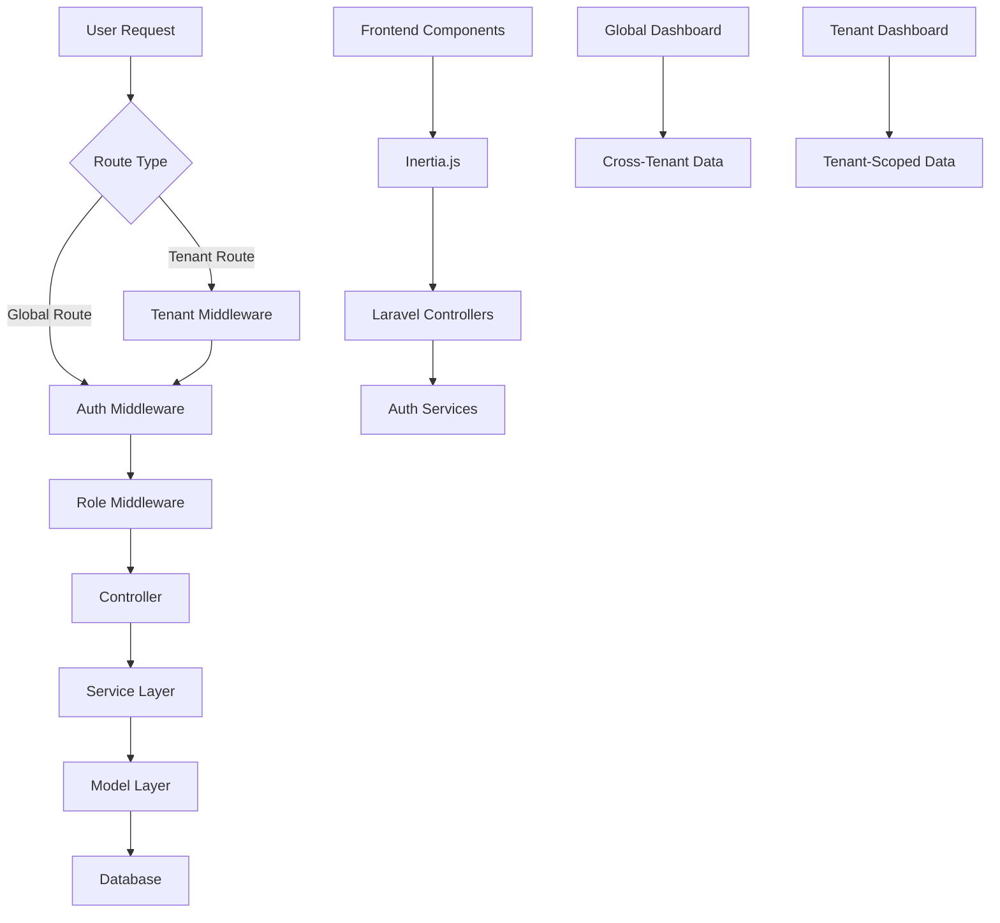
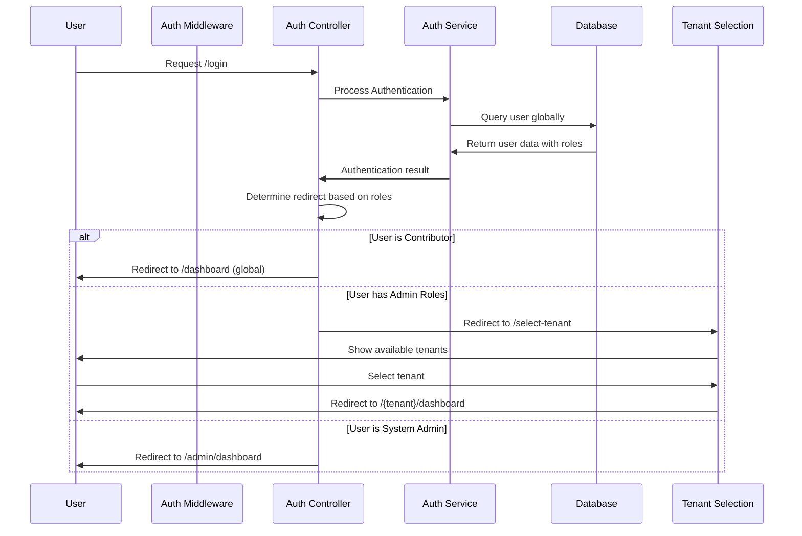

# Authentication & Authorization Design Document

## Overview

This design document outlines the **Authentication System** implemented for the Sannu-Sannu platform. The system provides global user authentication with multi-tenant role-based access control, allowing users to authenticate once and access multiple tenant organizations based on their permissions.

## 🚨 **ARCHITECTURAL CHANGE** 🚨

**Previous Design**: Tenant-scoped authentication with users tied to specific tenants.
**New Design**: Authentication with flexible multi-tenant role assignments.

## Architecture

### High-Level Architecture



### Authentication Flow



## Components and Interfaces

### 1. Middleware Components

#### TenantMiddleware
- **Purpose**: Extract tenant information from URL path and set tenant context
- **Location**: `app/Http/Middleware/TenantMiddleware.php`
- **Responsibilities**:
  - Parse tenant slug from URL
  - Load tenant model and set in application context
  - Handle tenant not found scenarios
  - Redirect to appropriate tenant-specific routes

#### RoleMiddleware
- **Purpose**: Enforce role-based access control
- **Location**: `app/Http/Middleware/RoleMiddleware.php`
- **Responsibilities**:
  - Check user roles against required permissions
  - Handle unauthorized access attempts
  - Support multiple role requirements

### 2. Controller Enhancements

#### Enhanced Auth Controllers
- **LoginController**: Extend existing Laravel controller with tenant scoping
- **RegisterController**: Add tenant association during registration
- **ForgotPasswordController**: Ensure password resets work within tenant context
- **ResetPasswordController**: Maintain tenant context during password reset

### 3. Service Layer

#### AuthService
- **Purpose**: Handle authentication business logic with tenant awareness
- **Responsibilities**:
  - Tenant-scoped user authentication
  - Role assignment during registration
  - Session management with tenant context

#### TenantService
- **Purpose**: Manage tenant-related operations
- **Responsibilities**:
  - Tenant resolution from URL
  - Tenant context management
  - Tenant-scoped queries

### 4. Frontend Components

#### Auth Layout Components
- **AuthCard**: Centered card container for all auth forms
- **AuthForm**: Base form component with validation
- **AuthInput**: Styled input components with proper focus states
- **AuthButton**: Consistent button styling for auth actions

#### Page Components
- **Login**: Global login page with card layout and role-based redirects
- **Register**: Global registration page creating platform-wide accounts
- **SelectTenant**: Tenant selection interface for admin users
- **GlobalDashboard**: Cross-tenant project discovery for contributors
- **ForgotPassword**: Global password reset request page
- **ResetPassword**: Global password reset form page

#### New Controllers
- **TenantSelectionController**: Handles tenant selection for admin users
- **GlobalDashboardController**: Serves cross-tenant project data
- **SystemDashboardController**: Platform-wide administration interface

## Data Models

### User Model (Global)

```php
class User extends Authenticatable
{
    protected $fillable = [
        'name', 'email', 'password', 'role' // No tenant_id - users are global
    ];
    
    protected $casts = [
        'role' => Role::class, // Global role: system_admin, contributor
    ];
    
    // Multi-tenant role relationships
    public function tenantRoles()
    {
        return $this->hasMany(UserTenantRole::class);
    }
    
    public function tenants()
    {
        return $this->belongsToMany(Tenant::class, 'user_tenant_roles')
            ->withPivot('role', 'is_active');
    }
    
    // Role checking methods
    public function hasRoleInTenant(Role $role, int $tenantId): bool
    public function getRoleInTenant(int $tenantId): ?Role
    public function getAdminTenants()
    public function needsTenantSelection(): bool
}
```

### Multi-Tenant Role System

```php
enum Role: string
{
    // Global roles (stored in users.role)
    case SYSTEM_ADMIN = 'system_admin';
    case CONTRIBUTOR = 'contributor';
    
    // Tenant-specific roles (stored in user_tenant_roles.role)
    case TENANT_ADMIN = 'tenant_admin';
    case PROJECT_MANAGER = 'project_manager';
}

class UserTenantRole extends Model
{
    protected $fillable = ['user_id', 'tenant_id', 'role', 'is_active'];
    
    protected $casts = [
        'role' => Role::class,
        'is_active' => 'boolean',
    ];
}
```

### Tenant Model Integration

```php
class Tenant extends Model
{
    protected $fillable = ['name', 'slug', 'domain'];
    
    // Many-to-many relationship with users through roles
    public function users()
    {
        return $this->belongsToMany(User::class, 'user_tenant_roles')
            ->withPivot('role', 'is_active');
    }
    
    public function userTenantRoles()
    {
        return $this->hasMany(UserTenantRole::class);
    }
}
```

## Error Handling

### Authentication Errors
- **Invalid Credentials**: Display user-friendly error messages within card layout
- **Tenant Not Found**: Redirect to platform homepage with error message
- **Account Locked**: Show appropriate lockout message with recovery options
- **Email Not Verified**: Prompt for email verification with resend option

### Authorization Errors
- **Insufficient Permissions**: Display 403 error page with role requirements
- **Tenant Mismatch**: Redirect to correct tenant or show access denied
- **Session Expired**: Redirect to login with session timeout message

### Validation Errors
- **Form Validation**: Display inline validation errors within form cards
- **Server Errors**: Show generic error message with support contact information

## Testing Strategy

### Unit Tests
- **Middleware Tests**: Test tenant resolution and role checking
- **Service Tests**: Test authentication logic with tenant scoping
- **Model Tests**: Test user-tenant relationships and role assignments

### Feature Tests
- **Authentication Flow**: Test complete login/register/logout flows
- **Multi-Tenant Isolation**: Verify users can only access their tenant data
- **Role-Based Access**: Test permission enforcement across different roles

### Frontend Tests
- **Component Tests**: Test auth form components and validation
- **Integration Tests**: Test complete auth flows with Inertia.js
- **Accessibility Tests**: Ensure auth forms meet accessibility standards

## Security Considerations

### Existing Laravel Security (Maintained)
- CSRF protection on all forms
- Password hashing using Laravel's Hash facade
- Session security with secure cookies
- Rate limiting on authentication attempts

### Additional Security Measures
- **Tenant Isolation**: Ensure complete data separation between tenants
- **Role Validation**: Server-side role checking on all protected routes
- **Session Scoping**: Tenant context maintained throughout session
- **Audit Logging**: Log all authentication and authorization events

### Input Validation
- **Email Validation**: Proper email format and uniqueness within tenant
- **Password Strength**: Enforce strong password requirements
- **CSRF Tokens**: Validate on all state-changing operations
- **SQL Injection Prevention**: Use Eloquent ORM for all database queries

## Implementation Details

### Route Structure
```php
// Authentication routes (no tenant context required)
Route::middleware('guest')->group(function () {
    Route::get('login', [AuthenticatedSessionController::class, 'create'])
        ->name('login');
    Route::post('login', [AuthenticatedSessionController::class, 'store'])
        ->name('login.store');
    Route::get('register', [RegisteredUserController::class, 'create'])
        ->name('register');
    // ... other Auth routes
});

// Authenticated routes
Route::middleware('auth')->group(function () {
    Route::get('dashboard', GlobalDashboardController::class)
        ->name('dashboard');
    Route::get('select-tenant', [TenantSelectionController::class, 'show'])
        ->name('tenant.select');
    Route::post('select-tenant', [TenantSelectionController::class, 'store'])
        ->name('tenant.select.store');
    
    // System admin routes
    Route::middleware('can:manage-platform')->prefix('admin')->group(function () {
        Route::get('dashboard', SystemDashboardController::class);
        Route::get('tenants', TenantManagementController::class);
    });
});

// Tenant-specific routes (operational context)
Route::prefix('{tenant:slug}')->middleware(['tenant'])->group(function () {
    Route::get('dashboard', TenantDashboardController::class);
    Route::resource('projects', ProjectController::class);
    // ... other tenant-specific routes
});
```

### Middleware Registration
```php
// app/Http/Kernel.php
protected $middlewareGroups = [
    'web' => [
        // ... existing middleware
        \App\Http\Middleware\TenantMiddleware::class,
    ],
];

protected $routeMiddleware = [
    // ... existing middleware
    'role' => \App\Http\Middleware\RoleMiddleware::class,
];
```

### Frontend Component Structure
```
resources/js/
├── components/
│   ├── auth/
│   │   ├── AuthCard.tsx
│   │   ├── AuthForm.tsx
│   │   ├── AuthInput.tsx
│   │   └── AuthButton.tsx
│   └── ui/ (existing shadcn/ui components)
├── pages/
│   └── auth/
│       ├── Login.tsx
│       ├── Register.tsx
│       ├── ForgotPassword.tsx
│       └── ResetPassword.tsx
└── layouts/
    └── AuthLayout.tsx
```

### Styling Approach
- Use existing Tailwind CSS configuration
- Leverage shadcn/ui components for consistency
- Implement responsive design with mobile-first approach
- Ensure proper focus states and accessibility

## Integration Points

### Existing Laravel Features
- **Laravel Sanctum**: Continue using for session-based authentication
- **Laravel Validation**: Use existing validation rules and messages
- **Laravel Mail**: Use for password reset and verification emails
- **Laravel Events**: Hook into existing auth events for logging

### Inertia.js Integration
- **Form Handling**: Use Inertia form helpers for seamless form submission
- **Error Handling**: Leverage Inertia's error handling for validation display
- **Page Props**: Pass tenant context and user roles to frontend components
- **Redirects**: Handle authentication redirects through Inertia

### Database Integration
- **Existing Tables**: Extend users table with tenant_id and role columns
- **Foreign Keys**: Add proper relationships between users and tenants
- **Indexes**: Add database indexes for performance optimization
- **Migrations**: Create migrations to modify existing auth tables

## Performance Considerations

### Database Optimization
- **Tenant Scoping**: Add database indexes on tenant_id columns
- **Query Optimization**: Use eager loading for tenant relationships
- **Connection Pooling**: Leverage existing Laravel database connections

### Caching Strategy
- **Tenant Resolution**: Cache tenant lookups to reduce database queries
- **Role Permissions**: Cache user roles and permissions
- **Session Storage**: Use Redis for session storage in production

### Frontend Performance
- **Component Lazy Loading**: Load auth components only when needed
- **Bundle Optimization**: Ensure auth components don't bloat main bundle
- **Image Optimization**: Optimize any auth-related images or assets

This design provides a comprehensive approach to enhancing the existing Laravel authentication system while maintaining compatibility with existing features and adding the necessary multi-tenant and role-based functionality.