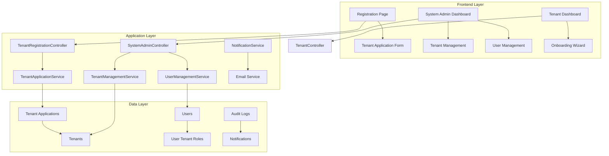

# Design Document

## Overview

The Tenant Registration System extends the existing global authentication architecture to support organizational tenant registration, approval workflows, and comprehensive system administration. This design builds upon the current multi-tenant infrastructure with global users, UserTenantRole relationships, and path-based tenant identification while adding sophisticated tenant lifecycle management and cross-platform user administration capabilities.

The system implements a controlled onboarding process for organizations, ensuring platform quality while providing system administrators with powerful tools to manage tenants, users, and platform operations at scale. It leverages the existing Role enum, User model relationships, and controller patterns established in the current codebase.

## Architecture

### High-Level Architecture



### Component Integration

The system integrates with existing components:

- **Global Authentication**: Leverages existing user authentication system
- **Multi-Tenant Infrastructure**: Extends current tenant model and middleware
- **Role-Based Access Control**: Builds upon existing RBAC system
- **Notification System**: Integrates with existing email and notification infrastructure
- **Audit System**: Extends current audit logging capabilities

## Components and Interfaces

### Backend Components

#### 1. Tenant Registration Controller

```php
<?php

namespace App\Http\Controllers\Auth;

use App\Http\Controllers\Controller;
use App\Http\Requests\TenantApplicationRequest;
use App\Models\TenantApplication;
use App\Services\TenantApplicationService;
use Illuminate\Http\RedirectResponse;
use Inertia\Inertia;
use Inertia\Response;

class TenantRegistrationController extends Controller
{
    public function __construct(
        private TenantApplicationService $tenantApplicationService
    ) {}

    public function showRegistrationForm(): Response
    {
        return Inertia::render('Auth/TenantRegistration', [
            'industryTypes' => $this->getIndustryTypes(),
        ]);
    }

    public function store(TenantApplicationRequest $request): RedirectResponse
    {
        $application = $this->tenantApplicationService->createApplication(
            $request->validated()
        );

        return redirect()->route('tenant-application.status', $application->reference_number)
            ->with('success', 'Your tenant application has been submitted successfully. You will receive an email confirmation shortly.');
    }

    public function showApplicationStatus(string $referenceNumber): Response
    {
        $application = TenantApplication::where('reference_number', $referenceNumber)
            ->firstOrFail();

        return Inertia::render('Auth/TenantApplicationStatus', [
            'application' => [
                'reference_number' => $application->reference_number,
                'organization_name' => $application->organization_name,
                'status' => $application->status,
                'submitted_at' => $application->submitted_at,
                'reviewed_at' => $application->reviewed_at,
                'rejection_reason' => $application->rejection_reason,
            ],
        ]);
    }

    private function getIndustryTypes(): array
    {
        return [
            'technology' => 'Technology',
            'healthcare' => 'Healthcare',
            'finance' => 'Finance',
            'education' => 'Education',
            'retail' => 'Retail',
            'manufacturing' => 'Manufacturing',
            'consulting' => 'Consulting',
            'other' => 'Other',
        ];
    }
}
```

**Responsibilities:**
- Handle tenant application form display and submission
- Validate application data
- Create pending tenant applications
- Provide application status checking

#### 2. Admin Controllers

```php
<?php

namespace App\Http\Controllers\Admin;

use App\Http\Controllers\Controller;
use App\Http\Requests\RejectTenantRequest;
use App\Http\Requests\SuspendTenantRequest;
use App\Http\Requests\UpdateUserRolesRequest;
use App\Http\Requests\BulkUserActionsRequest;
use App\Models\TenantApplication;
use App\Models\Tenant;
use App\Models\User;
use App\Services\TenantApplicationService;
use App\Services\TenantManagementService;
use App\Services\UserManagementService;
use Illuminate\Http\RedirectResponse;
use Inertia\Inertia;
use Inertia\Response;

class DashboardController extends Controller
{
    public function __construct(
        private TenantApplicationService $tenantApplicationService,
        private TenantManagementService $tenantManagementService,
        private UserManagementService $userManagementService
    ) {
        $this->middleware(['auth', 'verified', 'system-admin']);
    }

    public function dashboard(): Response
    {
        return Inertia::render('Admin/Dashboard', [
            'stats' => [
                'pending_applications' => TenantApplication::where('status', 'pending')->count(),
                'total_tenants' => Tenant::count(),
                'active_tenants' => Tenant::where('status', 'active')->count(),
                'total_users' => User::count(),
                'active_users' => User::where('is_active', true)->count(),
            ],
            'recent_applications' => TenantApplication::with('reviewer')
                ->latest()
                ->limit(5)
                ->get(),
        ]);
    }

    public function tenantApplications(): Response
    {
        $applications = TenantApplication::with('reviewer')
            ->when(request('status'), function ($query, $status) {
                $query->where('status', $status);
            })
            ->when(request('search'), function ($query, $search) {
                $query->where('organization_name', 'like', "%{$search}%")
                      ->orWhere('contact_person_name', 'like', "%{$search}%");
            })
            ->latest()
            ->paginate(15);

        return Inertia::render('Admin/TenantApplications/Index', [
            'applications' => $applications,
            'filters' => request()->only(['status', 'search']),
        ]);
    }

    public function showTenantApplication(TenantApplication $application): Response
    {
        $application->load('reviewer');

        return Inertia::render('Admin/TenantApplications/Show', [
            'application' => $application,
        ]);
    }

    public function approveTenant(TenantApplication $application): RedirectResponse
    {
        $tenant = $this->tenantApplicationService->approveApplication(
            $application,
            auth()->user()
        );

        return redirect()->route('admin.tenant-applications.index')
            ->with('success', "Tenant application approved. {$tenant->name} is now active.");
    }

    public function rejectTenant(TenantApplication $application, RejectTenantRequest $request): RedirectResponse
    {
        $this->tenantApplicationService->rejectApplication(
            $application,
            $request->validated('reason'),
            auth()->user()
        );

        return redirect()->route('admin.tenant-applications.index')
            ->with('success', 'Tenant application rejected.');
    }
}

class TenantController extends Controller
{
    public function __construct(
        private TenantManagementService $tenantManagementService
    ) {
        $this->middleware(['auth', 'verified', 'system-admin']);
    }

    public function index(): Response
    {
        $tenants = Tenant::with(['application', 'suspendedBy'])
            ->when(request('status'), function ($query, $status) {
                $query->where('status', $status);
            })
            ->when(request('search'), function ($query, $search) {
                $query->where('name', 'like', "%{$search}%");
            })
            ->withCount(['users', 'projects', 'contributions'])
            ->latest()
            ->paginate(15);

        return Inertia::render('Admin/Tenants/Index', [
            'tenants' => $tenants,
            'filters' => request()->only(['status', 'search']),
        ]);
    }

    public function show(Tenant $tenant): Response
    {
        $tenant->load(['application', 'suspendedBy', 'onboardingProgress']);

        return Inertia::render('Admin/Tenants/Show', [
            'tenant' => $tenant,
            'metrics' => $tenant->getMetrics(),
            'recent_projects' => $tenant->projects()->latest()->limit(5)->get(),
            'recent_users' => $tenant->users()->latest()->limit(5)->get(),
        ]);
    }

    public function suspend(Tenant $tenant, SuspendTenantRequest $request): RedirectResponse
    {
        $this->tenantManagementService->suspendTenant(
            $tenant,
            $request->validated('reason'),
            auth()->user()
        );

        return redirect()->back()
            ->with('success', 'Tenant suspended successfully.');
    }

    public function reactivate(Tenant $tenant): RedirectResponse
    {
        $this->tenantManagementService->reactivateTenant($tenant, auth()->user());

        return redirect()->back()
            ->with('success', 'Tenant reactivated successfully.');
    }
}

class UserController extends Controller
{
    public function __construct(
        private UserManagementService $userManagementService
    ) {
        $this->middleware(['auth', 'verified', 'system-admin']);
    }

    public function index(): Response
    {
        $users = User::with(['tenants'])
            ->when(request('role'), function ($query, $role) {
                $query->where('role', $role);
            })
            ->when(request('search'), function ($query, $search) {
                $query->where('name', 'like', "%{$search}%")
                      ->orWhere('email', 'like', "%{$search}%");
            })
            ->when(request('tenant'), function ($query, $tenantId) {
                $query->whereHas('tenants', function ($q) use ($tenantId) {
                    $q->where('tenant_id', $tenantId);
                });
            })
            ->latest()
            ->paginate(15);

        return Inertia::render('Admin/Users/Index', [
            'users' => $users,
            'filters' => request()->only(['role', 'search', 'tenant']),
            'tenants' => Tenant::select('id', 'name')->orderBy('name')->get(),
        ]);
    }

    public function show(User $user): Response
    {
        $user->load(['tenants', 'tenantRoles.tenant', 'contributions.project']);

        return Inertia::render('Admin/Users/Show', [
            'user' => $user,
            'metrics' => $this->userManagementService->getUserMetrics($user),
        ]);
    }

    public function edit(User $user): Response
    {
        $user->load(['tenants', 'tenantRoles.tenant']);

        return Inertia::render('Admin/Users/Edit', [
            'user' => $user,
            'tenants' => Tenant::select('id', 'name')->orderBy('name')->get(),
        ]);
    }

    public function update(User $user, UpdateUserRequest $request): RedirectResponse
    {
        $this->userManagementService->updateUser(
            $user,
            $request->validated(),
            auth()->user()
        );

        return redirect()->route('admin.users.show', $user)
            ->with('success', 'User updated successfully.');
    }

    public function updateRoles(User $user, UpdateUserRolesRequest $request): RedirectResponse
    {
        $this->userManagementService->updateUserRoles(
            $user,
            $request->validated(),
            auth()->user()
        );

        return redirect()->back()
            ->with('success', 'User roles updated successfully.');
    }

    public function resetPassword(User $user): RedirectResponse
    {
        $this->userManagementService->resetUserPassword($user, auth()->user());

        return redirect()->back()
            ->with('success', 'Password reset email sent to user.');
    }

    public function resendVerificationEmail(User $user): RedirectResponse
    {
        $this->userManagementService->resendVerificationEmail($user, auth()->user());

        return redirect()->back()
            ->with('success', 'Verification email sent to user.');
    }

    public function markAsVerified(User $user): RedirectResponse
    {
        $this->userManagementService->markAsVerified($user, auth()->user());

        return redirect()->back()
            ->with('success', 'User email marked as verified.');
    }

    public function suspend(User $user, SuspendUserRequest $request): RedirectResponse
    {
        $this->userManagementService->suspendUser(
            $user,
            $request->validated('reason'),
            auth()->user()
        );

        return redirect()->back()
            ->with('success', 'User suspended successfully.');
    }

    public function reactivate(User $user): RedirectResponse
    {
        $this->userManagementService->reactivateUser($user, auth()->user());

        return redirect()->back()
            ->with('success', 'User reactivated successfully.');
    }

    public function bulkActions(BulkUserActionsRequest $request): RedirectResponse
    {
        $result = $this->userManagementService->bulkUpdateUsers(
            $request->validated('user_ids'),
            $request->validated('actions'),
            auth()->user()
        );

        return redirect()->back()
            ->with('success', "Bulk action completed. {$result['success']} users updated.");
    }
}
```

#### 3. Service Classes

```php
class TenantApplicationService
{
    public function createApplication(array $data): TenantApplication
    public function approveApplication(TenantApplication $application, User $approver): Tenant
    public function rejectApplication(TenantApplication $application, string $reason, User $rejector): void
    public function generateReferenceNumber(): string
}

class TenantManagementService
{
    public function getTenantMetrics(Tenant $tenant): array
    public function suspendTenant(Tenant $tenant, string $reason, User $admin): void
    public function reactivateTenant(Tenant $tenant, User $admin): void
    public function getTenantAnalytics(): array
}

class UserManagementService
{
    public function getUserMetrics(User $user): array
    public function updateUser(User $user, array $data, User $admin): User
    public function assignTenantRole(User $user, Tenant $tenant, string $role, User $admin): void
    public function removeTenantRole(User $user, Tenant $tenant, string $role, User $admin): void
    public function updateUserRoles(User $user, array $roleData, User $admin): void
    public function resetUserPassword(User $user, User $admin): void
    public function resendVerificationEmail(User $user, User $admin): void
    public function markAsVerified(User $user, User $admin): void
    public function suspendUser(User $user, string $reason, User $admin): void
    public function reactivateUser(User $user, User $admin): void
    public function bulkUpdateUsers(array $userIds, array $actions, User $admin): array
}

class OnboardingService
{
    public function createOnboardingChecklist(Tenant $tenant): array
    public function markChecklistItem(Tenant $tenant, string $item, bool $completed): void
    public function getOnboardingProgress(Tenant $tenant): array
}
```

### Frontend Components

#### 1. Registration Enhancement

```tsx
// Enhanced registration page with user type selection
interface RegistrationTypeSelectionProps {
  onSelectType: (type: 'contributor' | 'organization') => void
}

const RegistrationTypeSelection: React.FC<RegistrationTypeSelectionProps>

// Tenant application form
interface TenantApplicationFormProps {
  onSubmit: (data: TenantApplicationData) => void
  initialData?: Partial<TenantApplicationData>
}

const TenantApplicationForm: React.FC<TenantApplicationFormProps>
```

#### 2. System Admin Interface

```tsx
// System admin dashboard
const SystemAdminDashboard: React.FC

// Tenant management components
interface TenantListProps {
  tenants: Tenant[]
  onStatusChange: (tenant: Tenant, status: string) => void
}

const TenantList: React.FC<TenantListProps>
const TenantDetails: React.FC<{ tenant: Tenant }>
const TenantApplicationReview: React.FC<{ application: TenantApplication }>

// User management components
interface UserListProps {
  users: User[]
  onBulkAction: (userIds: string[], action: string) => void
}

const UserList: React.FC<UserListProps>
const UserDetails: React.FC<{ user: User }>
const UserRoleManager: React.FC<{ user: User, tenants: Tenant[] }>
```

#### 3. Onboarding Components

```tsx
// Onboarding wizard for new tenants
interface OnboardingWizardProps {
  tenant: Tenant
  checklist: OnboardingItem[]
  onComplete: () => void
}

const OnboardingWizard: React.FC<OnboardingWizardProps>
const OnboardingProgress: React.FC<{ progress: number }>
const OnboardingChecklist: React.FC<{ items: OnboardingItem[] }>
```

## Data Models

### Enhanced Models

#### 1. Tenant Application Model

```php
<?php

namespace App\Models;

use App\Enums\TenantApplicationStatus;
use Illuminate\Database\Eloquent\Model;
use Illuminate\Database\Eloquent\Relations\BelongsTo;
use Illuminate\Database\Eloquent\Relations\HasOne;
use Illuminate\Database\Eloquent\Factories\HasFactory;

class TenantApplication extends Model
{
    use HasFactory;

    protected $fillable = [
        'reference_number',
        'organization_name',
        'business_description',
        'industry_type',
        'contact_person_name',
        'contact_person_email',
        'contact_person_phone',
        'business_registration_number',
        'website_url',
        'status',
        'submitted_at',
        'reviewed_at',
        'reviewer_id',
        'rejection_reason',
        'notes'
    ];

    protected function casts(): array
    {
        return [
            'submitted_at' => 'datetime',
            'reviewed_at' => 'datetime',
            'status' => TenantApplicationStatus::class,
        ];
    }

    public function reviewer(): BelongsTo
    {
        return $this->belongsTo(User::class, 'reviewer_id');
    }

    public function tenant(): HasOne
    {
        return $this->hasOne(Tenant::class, 'application_id');
    }

    public function isApproved(): bool
    {
        return $this->status === TenantApplicationStatus::APPROVED;
    }

    public function isRejected(): bool
    {
        return $this->status === TenantApplicationStatus::REJECTED;
    }

    public function isPending(): bool
    {
        return $this->status === TenantApplicationStatus::PENDING;
    }

    public function canBeReviewed(): bool
    {
        return $this->isPending();
    }

    public function generateReferenceNumber(): string
    {
        return 'TA-' . now()->format('Ymd') . '-' . str_pad($this->id, 4, '0', STR_PAD_LEFT);
    }
}
```

#### 2. Enhanced Tenant Model

```php
<?php

namespace App\Models;

use App\Enums\TenantStatus;
use Illuminate\Database\Eloquent\Model;
use Illuminate\Database\Eloquent\Relations\BelongsTo;
use Illuminate\Database\Eloquent\Relations\HasOne;
use Illuminate\Database\Eloquent\Relations\HasMany;
use Illuminate\Database\Eloquent\Factories\HasFactory;

class Tenant extends Model
{
    use HasFactory;

    protected $fillable = [
        'slug',
        'name',
        'domain',
        'logo_url',
        'primary_color',
        'secondary_color',
        'platform_fee_percentage',
        'status',
        'trial_ends_at',
        'max_projects',
        'max_users',
        'max_storage_mb',
        'contact_name',
        'contact_email',
        'contact_phone',
        'settings',
        'is_active',
        'application_id',
        'suspended_at',
        'suspended_reason',
        'suspended_by'
    ];

    protected function casts(): array
    {
        return [
            'settings' => 'array',
            'trial_ends_at' => 'datetime',
            'is_active' => 'boolean',
            'status' => TenantStatus::class,
            'suspended_at' => 'datetime',
        ];
    }

    public function application(): BelongsTo
    {
        return $this->belongsTo(TenantApplication::class, 'application_id');
    }

    public function suspendedBy(): BelongsTo
    {
        return $this->belongsTo(User::class, 'suspended_by');
    }

    public function onboardingProgress(): HasMany
    {
        return $this->hasMany(OnboardingProgress::class);
    }

    public function users()
    {
        return $this->belongsToMany(User::class, 'user_tenant_roles')
            ->withPivot('role', 'is_active')
            ->withTimestamps()
            ->wherePivot('is_active', true);
    }

    public function userTenantRoles()
    {
        return $this->hasMany(UserTenantRole::class);
    }

    public function projects()
    {
        return $this->hasMany(Project::class);
    }

    public function contributions()
    {
        return $this->hasMany(Contribution::class);
    }

    public function isActive(): bool
    {
        return $this->is_active && $this->status === TenantStatus::ACTIVE;
    }

    public function isSuspended(): bool
    {
        return $this->status === TenantStatus::SUSPENDED;
    }

    public function getMetrics(): array
    {
        return [
            'total_users' => $this->users()->count(),
            'total_projects' => $this->projects()->count(),
            'active_projects' => $this->projects()->where('status', 'active')->count(),
            'total_contributions' => $this->contributions()->count(),
            'total_revenue' => $this->contributions()->sum('total_paid'),
        ];
    }
}
```

#### 3. Onboarding Progress Model

```php
class OnboardingProgress extends Model
{
    protected $fillable = [
        'tenant_id',
        'step_key',
        'step_name',
        'completed',
        'completed_at',
        'data'
    ];

    protected $casts = [
        'completed' => 'boolean',
        'completed_at' => 'datetime',
        'data' => 'array'
    ];

    public function tenant(): BelongsTo
}
```

#### 4. Enhanced Audit Log Model

```php
class AuditLog extends Model
{
    protected $fillable = [
        'user_id',
        'action',
        'auditable_type',
        'auditable_id',
        'old_values',
        'new_values',
        'ip_address',
        'user_agent',
        'context'
    ];

    protected $casts = [
        'old_values' => 'array',
        'new_values' => 'array',
        'context' => 'array'
    ];

    public function user(): BelongsTo
    public function auditable(): MorphTo
}
```

### Required Enums

```php
<?php

namespace App\Enums;

enum TenantApplicationStatus: string
{
    case PENDING = 'pending';
    case APPROVED = 'approved';
    case REJECTED = 'rejected';

    public function label(): string
    {
        return match($this) {
            self::PENDING => 'Pending Review',
            self::APPROVED => 'Approved',
            self::REJECTED => 'Rejected',
        };
    }

    public function color(): string
    {
        return match($this) {
            self::PENDING => 'yellow',
            self::APPROVED => 'green',
            self::REJECTED => 'red',
        };
    }
}
```

```php
<?php

namespace App\Enums;

enum TenantStatus: string
{
    case ACTIVE = 'active';
    case SUSPENDED = 'suspended';
    case INACTIVE = 'inactive';

    public function label(): string
    {
        return match($this) {
            self::ACTIVE => 'Active',
            self::SUSPENDED => 'Suspended',
            self::INACTIVE => 'Inactive',
        };
    }

    public function color(): string
    {
        return match($this) {
            self::ACTIVE => 'green',
            self::SUSPENDED => 'red',
            self::INACTIVE => 'gray',
        };
    }
}
```

### Database Schema Updates

```sql
-- Tenant applications table
CREATE TABLE tenant_applications (
    id BIGINT UNSIGNED AUTO_INCREMENT PRIMARY KEY,
    reference_number VARCHAR(20) UNIQUE NOT NULL,
    organization_name VARCHAR(255) NOT NULL,
    business_description TEXT NOT NULL,
    industry_type VARCHAR(100) NOT NULL,
    contact_person_name VARCHAR(255) NOT NULL,
    contact_person_email VARCHAR(255) NOT NULL,
    contact_person_phone VARCHAR(20),
    business_registration_number VARCHAR(100),
    website_url VARCHAR(255),
    status ENUM('pending', 'approved', 'rejected') DEFAULT 'pending',
    submitted_at TIMESTAMP NOT NULL,
    reviewed_at TIMESTAMP NULL,
    reviewer_id BIGINT UNSIGNED NULL,
    rejection_reason TEXT NULL,
    notes TEXT NULL,
    created_at TIMESTAMP NULL,
    updated_at TIMESTAMP NULL,
    
    INDEX idx_status (status),
    INDEX idx_submitted_at (submitted_at),
    FOREIGN KEY (reviewer_id) REFERENCES users(id) ON DELETE SET NULL
);

-- Enhanced tenants table
ALTER TABLE tenants ADD COLUMN application_id BIGINT UNSIGNED NULL;
ALTER TABLE tenants ADD COLUMN status ENUM('active', 'suspended', 'inactive') DEFAULT 'active';
ALTER TABLE tenants ADD COLUMN suspended_at TIMESTAMP NULL;
ALTER TABLE tenants ADD COLUMN suspended_reason TEXT NULL;
ALTER TABLE tenants ADD COLUMN suspended_by BIGINT UNSIGNED NULL;
ALTER TABLE tenants ADD FOREIGN KEY (application_id) REFERENCES tenant_applications(id) ON DELETE SET NULL;
ALTER TABLE tenants ADD FOREIGN KEY (suspended_by) REFERENCES users(id) ON DELETE SET NULL;

-- Onboarding progress table
CREATE TABLE onboarding_progress (
    id BIGINT UNSIGNED AUTO_INCREMENT PRIMARY KEY,
    tenant_id BIGINT UNSIGNED NOT NULL,
    step_key VARCHAR(100) NOT NULL,
    step_name VARCHAR(255) NOT NULL,
    completed BOOLEAN DEFAULT FALSE,
    completed_at TIMESTAMP NULL,
    data JSON NULL,
    created_at TIMESTAMP NULL,
    updated_at TIMESTAMP NULL,
    
    UNIQUE KEY unique_tenant_step (tenant_id, step_key),
    FOREIGN KEY (tenant_id) REFERENCES tenants(id) ON DELETE CASCADE
);

-- Enhanced audit logs table
CREATE TABLE audit_logs (
    id BIGINT UNSIGNED AUTO_INCREMENT PRIMARY KEY,
    user_id BIGINT UNSIGNED NULL,
    action VARCHAR(100) NOT NULL,
    auditable_type VARCHAR(255) NOT NULL,
    auditable_id BIGINT UNSIGNED NOT NULL,
    old_values JSON NULL,
    new_values JSON NULL,
    ip_address VARCHAR(45) NULL,
    user_agent TEXT NULL,
    context JSON NULL,
    created_at TIMESTAMP NULL,
    
    INDEX idx_user_id (user_id),
    INDEX idx_auditable (auditable_type, auditable_id),
    INDEX idx_action (action),
    INDEX idx_created_at (created_at),
    FOREIGN KEY (user_id) REFERENCES users(id) ON DELETE SET NULL
);
```

## Error Handling

### Validation Rules

#### Form Request Classes

```php
<?php

namespace App\Http\Requests;

use Illuminate\Foundation\Http\FormRequest;

class TenantApplicationRequest extends FormRequest
{
    public function authorize(): bool
    {
        return true;
    }

    public function rules(): array
    {
        return [
            'organization_name' => ['required', 'string', 'max:255', 'unique:tenant_applications,organization_name'],
            'business_description' => ['required', 'string', 'min:50', 'max:1000'],
            'industry_type' => ['required', 'string', 'in:' . implode(',', array_keys($this->getIndustryTypes()))],
            'contact_person_name' => ['required', 'string', 'max:255'],
            'contact_person_email' => ['required', 'email', 'max:255'],
            'contact_person_phone' => ['nullable', 'string', 'regex:/^[\+]?[0-9\s\-\(\)]+$/'],
            'business_registration_number' => ['nullable', 'string', 'max:100'],
            'website_url' => ['nullable', 'url', 'max:255']
        ];
    }

    public function messages(): array
    {
        return [
            'organization_name.unique' => 'An organization with this name already exists.',
            'business_description.min' => 'Please provide a more detailed business description (at least 50 characters).',
            'contact_person_email.email' => 'Please provide a valid email address.',
            'website_url.url' => 'Please provide a valid website URL.'
        ];
    }

    private function getIndustryTypes(): array
    {
        return [
            'technology' => 'Technology',
            'healthcare' => 'Healthcare',
            'finance' => 'Finance',
            'education' => 'Education',
            'retail' => 'Retail',
            'manufacturing' => 'Manufacturing',
            'consulting' => 'Consulting',
            'other' => 'Other',
        ];
    }
}

class UpdateUserRequest extends FormRequest
{
    public function authorize(): bool
    {
        return auth()->user()->canManagePlatform();
    }

    public function rules(): array
    {
        return [
            'name' => ['required', 'string', 'max:255'],
            'email' => ['required', 'email', 'max:255', 'unique:users,email,' . $this->user->id],
            'phone' => ['nullable', 'string', 'max:20'],
            'bio' => ['nullable', 'string', 'max:500'],
            'is_active' => ['boolean'],
        ];
    }
}

class UpdateUserRolesRequest extends FormRequest
{
    public function authorize(): bool
    {
        return auth()->user()->canManagePlatform();
    }

    public function rules(): array
    {
        return [
            'global_role' => ['required', 'string', 'in:system_admin,contributor'],
            'tenant_roles' => ['array'],
            'tenant_roles.*.tenant_id' => ['required', 'exists:tenants,id'],
            'tenant_roles.*.role' => ['required', 'string', 'in:tenant_admin,project_manager'],
            'tenant_roles.*.is_active' => ['boolean'],
        ];
    }
}

class SuspendUserRequest extends FormRequest
{
    public function authorize(): bool
    {
        return auth()->user()->canManagePlatform();
    }

    public function rules(): array
    {
        return [
            'reason' => ['required', 'string', 'max:500'],
        ];
    }
}

class RejectTenantRequest extends FormRequest
{
    public function authorize(): bool
    {
        return auth()->user()->canManagePlatform();
    }

    public function rules(): array
    {
        return [
            'reason' => ['required', 'string', 'max:500'],
        ];
    }
}

class SuspendTenantRequest extends FormRequest
{
    public function authorize(): bool
    {
        return auth()->user()->canManagePlatform();
    }

    public function rules(): array
    {
        return [
            'reason' => ['required', 'string', 'max:500'],
        ];
    }
}

class BulkUserActionsRequest extends FormRequest
{
    public function authorize(): bool
    {
        return auth()->user()->canManagePlatform();
    }

    public function rules(): array
    {
        return [
            'user_ids' => ['required', 'array', 'min:1'],
            'user_ids.*' => ['exists:users,id'],
            'actions' => ['required', 'array'],
            'actions.suspend' => ['boolean'],
            'actions.activate' => ['boolean'],
            'actions.verify_email' => ['boolean'],
            'actions.suspend_reason' => ['required_if:actions.suspend,true', 'string', 'max:500'],
        ];
    }
}
```

### Exception Handling

```php
class TenantApplicationException extends Exception {}
class TenantSuspensionException extends Exception {}
class UserManagementException extends Exception {}
class OnboardingException extends Exception {}
```

## Testing Strategy

### Backend Testing

#### Unit Tests
- Model relationships and methods
- Service class business logic
- Validation rules and custom validators
- Helper functions and utilities

#### Feature Tests
- Tenant application submission and processing
- System admin approval/rejection workflows
- User management operations
- Onboarding process completion
- Audit logging functionality

#### Integration Tests
- Email notification delivery
- Multi-tenant access control
- Cross-tenant user role management
- Database transaction integrity

### Frontend Testing

#### Component Tests
- Registration type selection
- Tenant application form validation
- System admin interface interactions
- Onboarding wizard progression

#### Integration Tests
- Form submission and error handling
- Real-time notification updates
- Bulk user operations
- Search and filtering functionality

#### E2E Tests
- Complete tenant registration flow
- System admin approval process
- User role assignment workflow
- Onboarding completion journey

### Test Data Management

```php
// Factory for tenant applications
class TenantApplicationFactory extends Factory
{
    public function definition(): array
    {
        return [
            'reference_number' => $this->generateReferenceNumber(),
            'organization_name' => $this->faker->company(),
            'business_description' => $this->faker->paragraphs(3, true),
            'industry_type' => $this->faker->randomElement(['technology', 'healthcare', 'finance', 'education']),
            'contact_person_name' => $this->faker->name(),
            'contact_person_email' => $this->faker->safeEmail(),
            'contact_person_phone' => $this->faker->phoneNumber(),
            'website_url' => $this->faker->url(),
            'status' => 'pending',
            'submitted_at' => now()
        ];
    }

    public function approved(): static
    public function rejected(): static
    public function withReviewer(User $reviewer): static
}
```

## Security Considerations

### Access Control
- System admin role verification for all administrative operations
- Tenant-specific access validation for tenant administrators
- Cross-tenant access prevention for regular users
- API rate limiting for bulk operations

### Data Protection
- Sensitive data encryption for tenant applications
- Audit trail protection and integrity verification
- Secure handling of rejection reasons and notes
- GDPR compliance for user data management

### Input Validation
- Comprehensive validation for all form inputs
- SQL injection prevention through parameterized queries
- XSS protection for user-generated content
- File upload security for tenant documents

## Performance Considerations

### Database Optimization
- Proper indexing for search and filtering operations
- Query optimization for large tenant and user lists
- Pagination for all list views
- Caching for frequently accessed data

### Frontend Performance
- Lazy loading for large data sets
- Debounced search functionality
- Optimistic updates for better UX
- Progressive loading for dashboard metrics

### Scalability
- Queue-based processing for bulk operations
- Background job processing for notifications
- Database connection pooling
- CDN integration for static assets

This design provides a comprehensive foundation for implementing the tenant registration system while maintaining security, performance, and user experience standards.