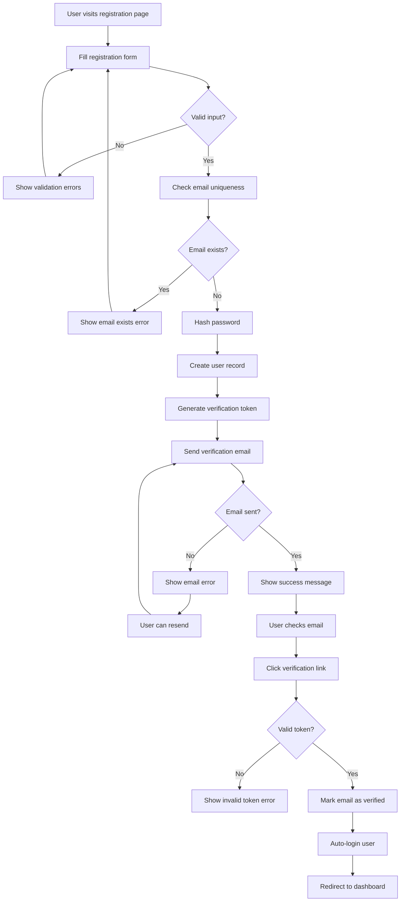
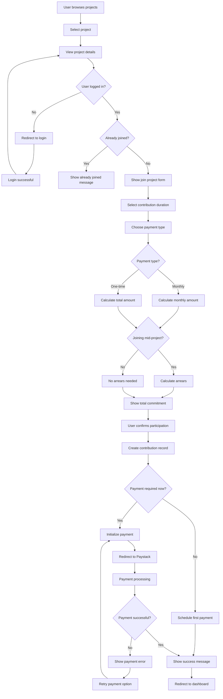
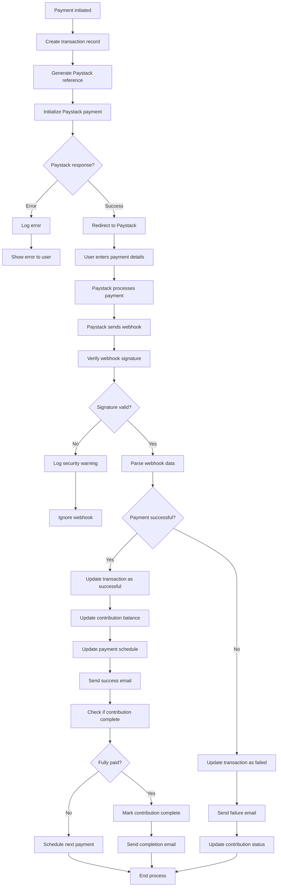
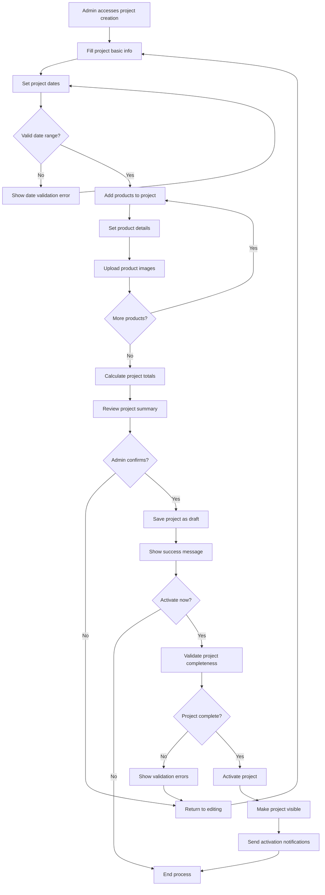
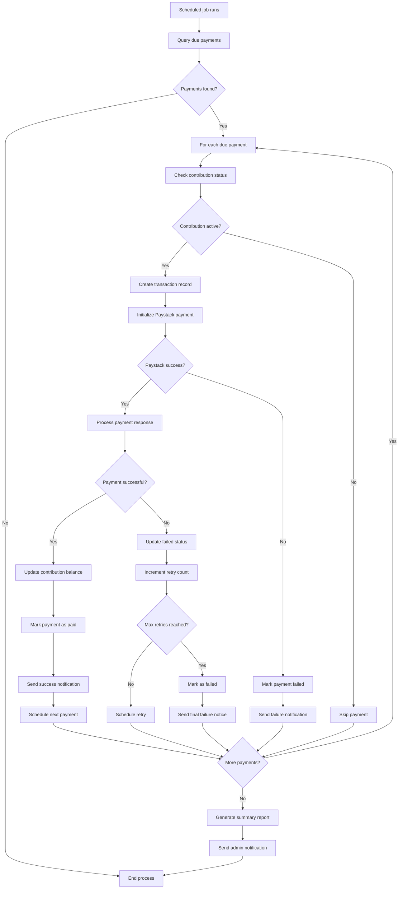
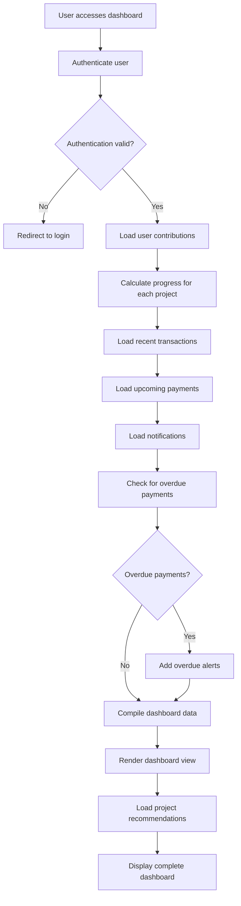
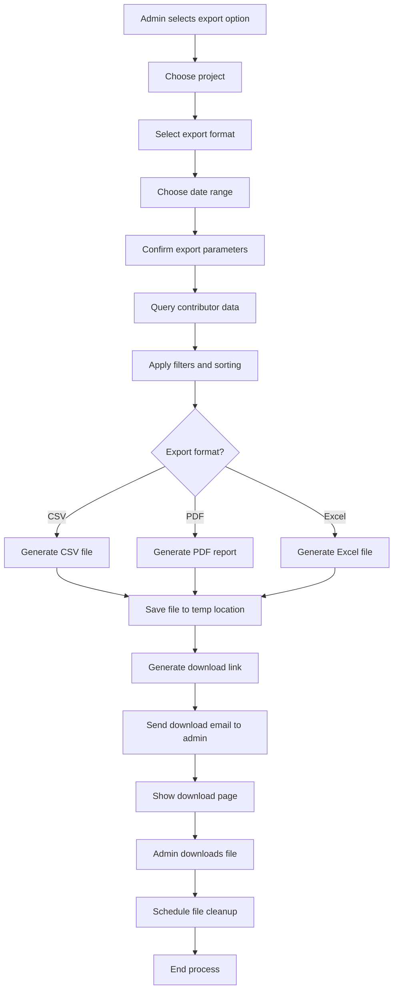
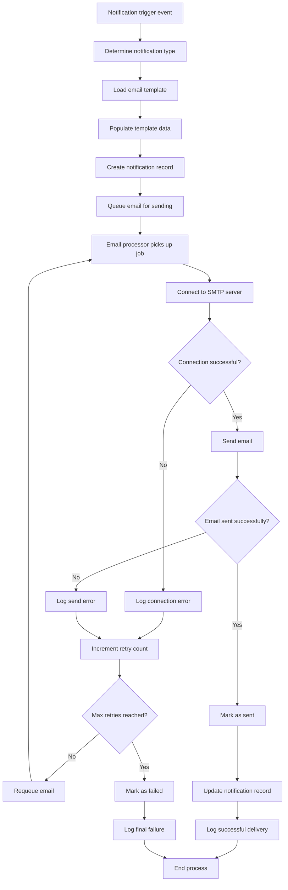
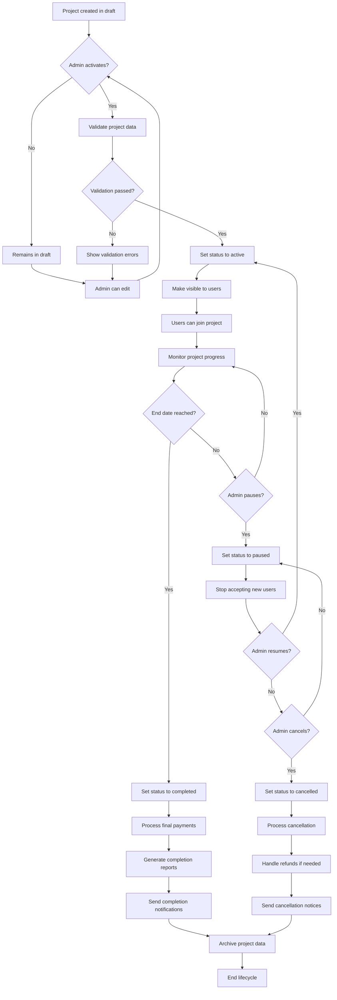
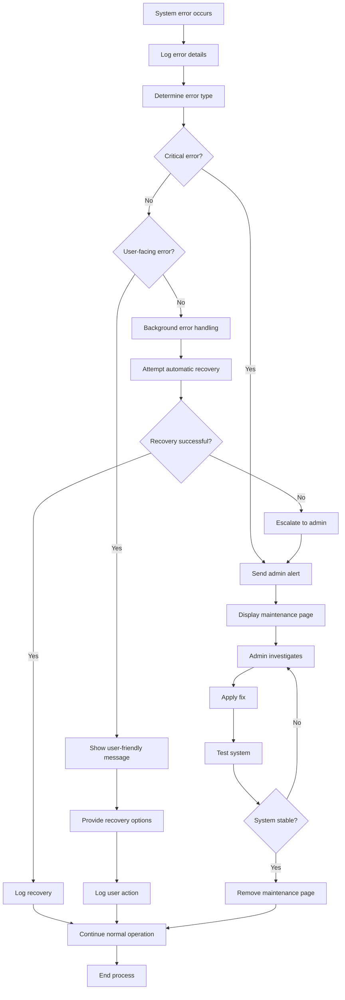

# Activity Diagrams
## Sannu-Sannu SaaS Platform

### Overview

This document contains activity diagrams for key business processes in the Sannu-Sannu platform, showing the flow of activities and decision points for critical user journeys.

---

## 1. User Registration Process

---

## 2. Project Joining Process

---

## 3. Payment Processing Workflow

---

## 4. Admin Project Creation Process

---

## 5. Monthly Payment Processing (Automated)

---

## 6. User Dashboard Data Loading

---

## 7. Admin Export Process

---

## 8. Email Notification Process

---

## 9. Project Lifecycle Management

---

## 10. Error Handling and Recovery

### Activity Diagram Conventions

#### Symbols Used
- **Rounded rectangles**: Activities/Actions
- **Diamonds**: Decision points
- **Circles**: Start/End points
- **Arrows**: Flow direction
- **Parallel bars**: Concurrent activities

#### Decision Logic
- Each decision point shows the condition being evaluated
- Alternative paths are clearly labeled (Yes/No, specific conditions)
- Error paths and recovery mechanisms are included
- Loops and iterations are properly represented

#### Process Integration
- Activities show integration points with external systems (Paystack, Email)
- Database operations are implied within activities
- User interactions are clearly distinguished from system processes
- Admin actions are separated from user actions

These activity diagrams provide a comprehensive view of the system's operational flows and can be used for:
- Development planning and implementation
- Quality assurance testing scenarios
- User training and documentation
- System maintenance and troubleshooting
- Business process optimization