# Multi-Tenant Database Schema

## Sannu-Sannu SaaS Platform

### Schema Overview

This document contains the complete SQL schema for the multi-tenant Sannu-Sannu platform. The architecture uses single database multi-tenancy with complete data isolation between tenants.

#### Database Configuration

```sql
-- Create database
CREATE DATABASE sannu_sannu CHARACTER SET utf8mb4 COLLATE utf8mb4_unicode_ci;
USE sannu_sannu;

-- Set SQL mode for strict data validation
SET sql_mode = 'STRICT_TRANS_TABLES,ERROR_FOR_DIVISION_BY_ZERO,NO_AUTO_CREATE_USER,NO_ENGINE_SUBSTITUTION';
```

### Entity Relationship Diagram

```mermaid
erDiagram
    TENANTS {
        int id PK
        varchar slug UK
        varchar name
        varchar domain UK
        varchar logo_url
        varchar primary_color
        varchar secondary_color
        decimal platform_fee_percentage
        enum status
        timestamp trial_ends_at
        int max_projects
        int max_users
        int max_storage_mb
        varchar contact_name
        varchar contact_email
        varchar contact_phone
        json settings
        boolean is_active
        timestamp created_at
        timestamp updated_at
    }

    USERS {
        int id PK
        int tenant_id FK
        varchar name
        varchar email
        varchar password_hash
        enum role
        varchar theme_preference
        json custom_theme_colors
        varchar phone
        varchar avatar_url
        text bio
        boolean is_active
        timestamp email_verified_at
        timestamp last_login_at
        varchar remember_token
        timestamp created_at
        timestamp updated_at
    }

    PROJECTS {
        int id PK
        int tenant_id FK
        varchar name
        varchar slug
        text description
        enum visibility
        boolean requires_approval
        decimal total_amount
        decimal minimum_contribution
        json payment_options
        enum installment_frequency
        int custom_installment_months
        date start_date
        date end_date
        date registration_deadline
        int created_by FK
        json managed_by
        enum status
        json settings
        timestamp created_at
        timestamp updated_at
    }

    PROJECT_INVITATIONS {
        int id PK
        int project_id FK
        varchar email
        int invited_by FK
        varchar token UK
        enum status
        timestamp expires_at
        timestamp accepted_at
        timestamp created_at
        timestamp updated_at
    }

    CONTRIBUTIONS {
        int id PK
        int tenant_id FK
        int user_id FK
        int project_id FK
        decimal total_committed
        enum payment_type
        decimal installment_amount
        enum installment_frequency
        int total_installments
        decimal arrears_amount
        decimal arrears_paid
        decimal total_paid
        date next_payment_due
        enum status
        date joined_date
        enum approval_status
        int approved_by FK
        timestamp approved_at
        timestamp created_at
        timestamp updated_at
    }

    TRANSACTIONS {
        int id PK
        int tenant_id FK
        int contribution_id FK
        int user_id FK
        varchar paystack_reference UK
        decimal amount
        enum type
        enum status
        json paystack_response
        varchar failure_reason
        timestamp processed_at
        timestamp created_at
        timestamp updated_at
    }

    PRODUCTS {
        int id PK
        int tenant_id FK
        int project_id FK
        varchar name
        text description
        decimal price
        varchar image_url
        int sort_order
        timestamp created_at
        timestamp updated_at
    }

    PAYMENT_SCHEDULES {
        int id PK
        int tenant_id FK
        int contribution_id FK
        decimal amount
        date due_date
        enum status
        int transaction_id FK
        timestamp paid_at
        timestamp created_at
        timestamp updated_at
    }

    THEMES {
        varchar id PK
        varchar name
        enum type
        json colors
        varchar radius
        boolean is_default
        boolean is_active
        timestamp created_at
        timestamp updated_at
    }

    TENANTS ||--o{ USERS : has
    TENANTS ||--o{ PROJECTS : contains
    TENANTS ||--o{ CONTRIBUTIONS : manages
    TENANTS ||--o{ TRANSACTIONS : processes
    TENANTS ||--o{ PRODUCTS : owns
    TENANTS ||--o{ PAYMENT_SCHEDULES : tracks

    USERS ||--o{ PROJECTS : creates
    USERS ||--o{ CONTRIBUTIONS : makes
    USERS ||--o{ TRANSACTIONS : initiates
    USERS ||--o{ PROJECT_INVITATIONS : sends


    PROJECTS ||--o{ PRODUCTS : contains
    PROJECTS ||--o{ CONTRIBUTIONS : receives
    PROJECTS ||--o{ PROJECT_INVITATIONS : generates

    CONTRIBUTIONS ||--o{ TRANSACTIONS : generates
    CONTRIBUTIONS ||--o{ PAYMENT_SCHEDULES : has

    TRANSACTIONS ||--o| PAYMENT_SCHEDULES : fulfills

    PLATFORM_FEES {
        int id PK
        int tenant_id FK
        int project_id FK
        int transaction_id FK
        decimal project_amount
        decimal fee_percentage
        decimal fee_amount
        enum status
        timestamp calculated_at
        timestamp paid_at
        timestamp created_at
        timestamp updated_at
    }

    TENANTS ||--o{ PLATFORM_FEES : generates
    PROJECTS ||--o{ PLATFORM_FEES : incurs
    TRANSACTIONS ||--o{ PLATFORM_FEES : triggers
```



---

## Core Tables

### TENANTS Table

Central table for multi-tenant architecture, storing company/business information.

```sql
CREATE TABLE tenants (
    id INT UNSIGNED AUTO_INCREMENT PRIMARY KEY,
    slug VARCHAR(100) NOT NULL UNIQUE, -- Used in URL path: sannu-sannu.com/{slug}
    name VARCHAR(255) NOT NULL,
    domain VARCHAR(255) NULL UNIQUE, -- Optional custom domain for future
    logo_url VARCHAR(500) NULL,
    primary_color VARCHAR(7) DEFAULT '#3B82F6',
    secondary_color VARCHAR(7) DEFAULT '#10B981',

    -- Revenue sharing model
    platform_fee_percentage DECIMAL(5,2) DEFAULT 5.00, -- Platform fee (e.g., 5%)
    status ENUM('active', 'suspended', 'cancelled') DEFAULT 'active',
    trial_ends_at TIMESTAMP NULL,

    -- Optional limits (for abuse prevention)
    max_projects INT NULL, -- NULL = unlimited
    max_users INT NULL, -- NULL = unlimited
    max_storage_mb INT DEFAULT 10000, -- 10GB default

    -- Contact information
    contact_name VARCHAR(255) NOT NULL,
    contact_email VARCHAR(255) NOT NULL,
    contact_phone VARCHAR(20) NULL,

    -- Settings
    settings JSON NULL,
    is_active BOOLEAN DEFAULT TRUE,

    created_at TIMESTAMP DEFAULT CURRENT_TIMESTAMP,
    updated_at TIMESTAMP DEFAULT CURRENT_TIMESTAMP ON UPDATE CURRENT_TIMESTAMP,

    INDEX idx_tenants_slug (slug),
    INDEX idx_tenants_domain (domain),
    INDEX idx_tenants_status (subscription_status),
    INDEX idx_tenants_active (is_active)
) ENGINE=InnoDB;
```

### USERS Table

Stores user accounts with tenant isolation.

```sql
CREATE TABLE users (
    id INT UNSIGNED AUTO_INCREMENT PRIMARY KEY,
    tenant_id INT UNSIGNED NOT NULL,
    name VARCHAR(255) NOT NULL,
    email VARCHAR(255) NOT NULL,
    password_hash VARCHAR(255) NOT NULL,

    -- Role within tenant
    role ENUM('tenant_admin', 'project_manager', 'contributor') NOT NULL DEFAULT 'contributor',


    -- Profile information
    phone VARCHAR(20) NULL,
    avatar_url VARCHAR(500) NULL,
    bio TEXT NULL,

    -- Status
    is_active BOOLEAN DEFAULT TRUE,
    email_verified_at TIMESTAMP NULL,
    last_login_at TIMESTAMP NULL,

    remember_token VARCHAR(100) NULL,
    created_at TIMESTAMP DEFAULT CURRENT_TIMESTAMP,
    updated_at TIMESTAMP DEFAULT CURRENT_TIMESTAMP ON UPDATE CURRENT_TIMESTAMP,

    FOREIGN KEY (tenant_id) REFERENCES tenants(id) ON DELETE CASCADE,
    UNIQUE KEY uk_users_tenant_email (tenant_id, email),
    INDEX idx_users_tenant (tenant_id),
    INDEX idx_users_email (email),
    INDEX idx_users_role (role),
    INDEX idx_users_active (is_active)
) ENGINE=InnoDB;
```

### PROJECTS Table

Stores project information with public/private visibility and flexible payment options.

```sql
CREATE TABLE projects (
    id INT UNSIGNED AUTO_INCREMENT PRIMARY KEY,
    tenant_id INT UNSIGNED NOT NULL,
    name VARCHAR(255) NOT NULL,
    slug VARCHAR(255) NOT NULL,
    description TEXT NULL,

    -- Project visibility and access
    visibility ENUM('public', 'private') NOT NULL DEFAULT 'public',
    requires_approval BOOLEAN DEFAULT FALSE,

    -- Financial details
    total_amount DECIMAL(12,2) NOT NULL,
    minimum_contribution DECIMAL(10,2) NULL,

    -- Payment flexibility
    payment_options JSON NOT NULL, -- ['full', 'installments']
    installment_frequency ENUM('monthly', 'quarterly', 'custom') DEFAULT 'monthly',
    custom_installment_months INT NULL,

    -- Timeline
    start_date DATE NOT NULL,
    end_date DATE NOT NULL,
    registration_deadline DATE NULL,

    -- Project management
    created_by INT UNSIGNED NOT NULL,
    managed_by JSON NULL, -- Array of user IDs who can manage
    status ENUM('draft', 'active', 'paused', 'completed', 'cancelled') NOT NULL DEFAULT 'draft',

    -- Settings
    settings JSON NULL,

    created_at TIMESTAMP DEFAULT CURRENT_TIMESTAMP,
    updated_at TIMESTAMP DEFAULT CURRENT_TIMESTAMP ON UPDATE CURRENT_TIMESTAMP,

    FOREIGN KEY (tenant_id) REFERENCES tenants(id) ON DELETE CASCADE,
    FOREIGN KEY (created_by) REFERENCES users(id) ON DELETE RESTRICT,
    UNIQUE KEY uk_projects_tenant_slug (tenant_id, slug),
    INDEX idx_projects_tenant (tenant_id),
    INDEX idx_projects_visibility (visibility),
    INDEX idx_projects_status (status),
    INDEX idx_projects_dates (start_date, end_date),

    CONSTRAINT chk_projects_dates CHECK (end_date > start_date),
    CONSTRAINT chk_projects_amounts CHECK (total_amount > 0)
) ENGINE=InnoDB;
```

### PROJECT_INVITATIONS Table

Manages invitations for private projects.

```sql
CREATE TABLE project_invitations (
    id INT UNSIGNED AUTO_INCREMENT PRIMARY KEY,
    project_id INT UNSIGNED NOT NULL,
    email VARCHAR(255) NOT NULL,
    invited_by INT UNSIGNED NOT NULL,
    token VARCHAR(100) NOT NULL UNIQUE,

    status ENUM('pending', 'accepted', 'declined', 'expired') DEFAULT 'pending',
    expires_at TIMESTAMP NOT NULL,
    accepted_at TIMESTAMP NULL,

    created_at TIMESTAMP DEFAULT CURRENT_TIMESTAMP,
    updated_at TIMESTAMP DEFAULT CURRENT_TIMESTAMP ON UPDATE CURRENT_TIMESTAMP,

    FOREIGN KEY (project_id) REFERENCES projects(id) ON DELETE CASCADE,
    FOREIGN KEY (invited_by) REFERENCES users(id) ON DELETE CASCADE,
    INDEX idx_invitations_project (project_id),
    INDEX idx_invitations_email (email),
    INDEX idx_invitations_token (token),
    INDEX idx_invitations_status (status)
) ENGINE=InnoDB;
```

### CONTRIBUTIONS Table

Tracks user participation with flexible payment options and arrears calculation.

```sql
CREATE TABLE contributions (
    id INT UNSIGNED AUTO_INCREMENT PRIMARY KEY,
    tenant_id INT UNSIGNED NOT NULL,
    user_id INT UNSIGNED NOT NULL,
    project_id INT UNSIGNED NOT NULL,

    -- Contribution details
    total_committed DECIMAL(12,2) NOT NULL,
    payment_type ENUM('full', 'installments') NOT NULL,

    -- Installment details (if applicable)
    installment_amount DECIMAL(10,2) NULL,
    installment_frequency ENUM('monthly', 'quarterly', 'custom') NULL,
    total_installments INT NULL,

    -- Arrears calculation for late joiners
    arrears_amount DECIMAL(10,2) NOT NULL DEFAULT 0.00,
    arrears_paid DECIMAL(10,2) NOT NULL DEFAULT 0.00,

    -- Payment tracking
    total_paid DECIMAL(12,2) NOT NULL DEFAULT 0.00,
    next_payment_due DATE NULL,

    -- Status and timeline
    status ENUM('active', 'completed', 'suspended', 'cancelled') NOT NULL DEFAULT 'active',
    joined_date DATE NOT NULL,

    -- Approval workflow (for private projects)
    approval_status ENUM('pending', 'approved', 'rejected') DEFAULT 'approved',
    approved_by INT UNSIGNED NULL,
    approved_at TIMESTAMP NULL,

    created_at TIMESTAMP DEFAULT CURRENT_TIMESTAMP,
    updated_at TIMESTAMP DEFAULT CURRENT_TIMESTAMP ON UPDATE CURRENT_TIMESTAMP,

    FOREIGN KEY (tenant_id) REFERENCES tenants(id) ON DELETE CASCADE,
    FOREIGN KEY (user_id) REFERENCES users(id) ON DELETE CASCADE,
    FOREIGN KEY (project_id) REFERENCES projects(id) ON DELETE CASCADE,
    FOREIGN KEY (approved_by) REFERENCES users(id) ON DELETE SET NULL,

    UNIQUE KEY uk_contributions_user_project (user_id, project_id),
    INDEX idx_contributions_tenant (tenant_id),
    INDEX idx_contributions_user (user_id),
    INDEX idx_contributions_project (project_id),
    INDEX idx_contributions_status (status),
    INDEX idx_contributions_approval (approval_status),
    INDEX idx_contributions_next_payment (next_payment_due),

    CONSTRAINT chk_contributions_amounts CHECK (
        total_committed > 0 AND
        total_paid >= 0 AND
        arrears_amount >= 0 AND
        arrears_paid >= 0
    )
) ENGINE=InnoDB;
```

### TRANSACTIONS Table

Records all payment transactions with tenant isolation.

```sql
CREATE TABLE transactions (
    id INT UNSIGNED AUTO_INCREMENT PRIMARY KEY,
    tenant_id INT UNSIGNED NOT NULL,
    contribution_id INT UNSIGNED NOT NULL,
    user_id INT UNSIGNED NOT NULL,
    paystack_reference VARCHAR(100) NOT NULL UNIQUE,
    amount DECIMAL(10,2) NOT NULL,
    type ENUM('full_payment', 'installment', 'arrears', 'partial') NOT NULL,
    status ENUM('pending', 'success', 'failed', 'cancelled') NOT NULL DEFAULT 'pending',
    paystack_response JSON NULL,
    failure_reason VARCHAR(500) NULL,
    processed_at TIMESTAMP NULL,
    created_at TIMESTAMP DEFAULT CURRENT_TIMESTAMP,
    updated_at TIMESTAMP DEFAULT CURRENT_TIMESTAMP ON UPDATE CURRENT_TIMESTAMP,

    FOREIGN KEY (tenant_id) REFERENCES tenants(id) ON DELETE CASCADE,
    FOREIGN KEY (contribution_id) REFERENCES contributions(id) ON DELETE RESTRICT,
    FOREIGN KEY (user_id) REFERENCES users(id) ON DELETE RESTRICT,
    INDEX idx_transactions_tenant (tenant_id),
    INDEX idx_transactions_reference (paystack_reference),
    INDEX idx_transactions_status (status),
    INDEX idx_transactions_contribution (contribution_id),
    INDEX idx_transactions_user (user_id),
    INDEX idx_transactions_created (created_at),

    CONSTRAINT chk_transactions_amount CHECK (amount > 0)
) ENGINE=InnoDB;
```

### PRODUCTS Table

Stores product information within projects.

```sql
CREATE TABLE products (
    id INT UNSIGNED AUTO_INCREMENT PRIMARY KEY,
    tenant_id INT UNSIGNED NOT NULL,
    project_id INT UNSIGNED NOT NULL,
    name VARCHAR(255) NOT NULL,
    description TEXT NULL,
    price DECIMAL(10,2) NOT NULL,
    image_url VARCHAR(500) NULL,
    sort_order INT NOT NULL DEFAULT 0,
    created_at TIMESTAMP DEFAULT CURRENT_TIMESTAMP,
    updated_at TIMESTAMP DEFAULT CURRENT_TIMESTAMP ON UPDATE CURRENT_TIMESTAMP,

    FOREIGN KEY (tenant_id) REFERENCES tenants(id) ON DELETE CASCADE,
    FOREIGN KEY (project_id) REFERENCES projects(id) ON DELETE CASCADE,
    INDEX idx_products_tenant (tenant_id),
    INDEX idx_products_project_sort (project_id, sort_order),

    CONSTRAINT chk_products_price CHECK (price > 0)
) ENGINE=InnoDB;
```

### PAYMENT_SCHEDULES Table

Manages scheduled payments for installment-based contributions.

```sql
CREATE TABLE payment_schedules (
    id INT UNSIGNED AUTO_INCREMENT PRIMARY KEY,
    tenant_id INT UNSIGNED NOT NULL,
    contribution_id INT UNSIGNED NOT NULL,
    amount DECIMAL(10,2) NOT NULL,
    due_date DATE NOT NULL,
    status ENUM('pending', 'paid', 'overdue', 'skipped') NOT NULL DEFAULT 'pending',
    transaction_id INT UNSIGNED NULL,
    paid_at TIMESTAMP NULL,
    created_at TIMESTAMP DEFAULT CURRENT_TIMESTAMP,
    updated_at TIMESTAMP DEFAULT CURRENT_TIMESTAMP ON UPDATE CURRENT_TIMESTAMP,

    FOREIGN KEY (tenant_id) REFERENCES tenants(id) ON DELETE CASCADE,
    FOREIGN KEY (contribution_id) REFERENCES contributions(id) ON DELETE CASCADE,
    FOREIGN KEY (transaction_id) REFERENCES transactions(id) ON DELETE SET NULL,
    INDEX idx_payment_schedules_tenant (tenant_id),
    INDEX idx_payment_schedules_due_date (due_date),
    INDEX idx_payment_schedules_status (status),
    INDEX idx_payment_schedules_contribution (contribution_id),

    CONSTRAINT chk_payment_schedules_amount CHECK (amount > 0)
) ENGINE=InnoDB;
```

### PLATFORM_FEES Table
Tracks platform revenue from project contributions.

```sql
CREATE TABLE platform_fees (
    id INT UNSIGNED AUTO_INCREMENT PRIMARY KEY,
    tenant_id INT UNSIGNED NOT NULL,
    project_id INT UNSIGNED NOT NULL,
    transaction_id INT UNSIGNED NOT NULL,
    
    -- Fee calculation
    project_amount DECIMAL(12,2) NOT NULL, -- Total project amount
    fee_percentage DECIMAL(5,2) NOT NULL, -- Fee percentage at time of calculation
    fee_amount DECIMAL(10,2) NOT NULL, -- Calculated fee amount
    
    -- Status tracking
    status ENUM('pending', 'calculated', 'paid') DEFAULT 'pending',
    calculated_at TIMESTAMP NULL,
    paid_at TIMESTAMP NULL,
    
    created_at TIMESTAMP DEFAULT CURRENT_TIMESTAMP,
    updated_at TIMESTAMP DEFAULT CURRENT_TIMESTAMP ON UPDATE CURRENT_TIMESTAMP,
    
    FOREIGN KEY (tenant_id) REFERENCES tenants(id) ON DELETE CASCADE,
    FOREIGN KEY (project_id) REFERENCES projects(id) ON DELETE CASCADE,
    FOREIGN KEY (transaction_id) REFERENCES transactions(id) ON DELETE CASCADE,
    
    INDEX idx_platform_fees_tenant (tenant_id),
    INDEX idx_platform_fees_project (project_id),
    INDEX idx_platform_fees_status (status),
    INDEX idx_platform_fees_calculated (calculated_at),
    
    CONSTRAINT chk_platform_fees_amounts CHECK (
        project_amount > 0 AND 
        fee_percentage >= 0 AND 
        fee_amount >= 0
    )
) ENGINE=InnoDB;
```


---

## Views for Multi-Tenant Queries

### Tenant Statistics View

```sql
CREATE VIEW tenant_statistics AS
SELECT
    t.id as tenant_id,
    t.name as tenant_name,
    t.platform_fee_percentage,
    t.status,
    COUNT(DISTINCT u.id) as total_users,
    COUNT(DISTINCT p.id) as total_projects,
    COUNT(DISTINCT c.id) as total_contributions,
    SUM(c.total_committed) as total_committed_amount,
    SUM(c.total_paid) as total_collected_amount,
    SUM(pf.fee_amount) as total_platform_fees,
    COUNT(DISTINCT CASE WHEN p.status = 'active' THEN p.id END) as active_projects,
    COUNT(DISTINCT CASE WHEN c.status = 'active' THEN c.id END) as active_contributions
FROM tenants t
LEFT JOIN users u ON t.id = u.tenant_id AND u.is_active = TRUE
LEFT JOIN projects p ON t.id = p.tenant_id
LEFT JOIN contributions c ON t.id = c.tenant_id
LEFT JOIN platform_fees pf ON t.id = pf.tenant_id AND pf.status = 'calculated'
GROUP BY t.id, t.name, t.platform_fee_percentage, t.status;
```

### Project Performance View

```sql
CREATE VIEW project_performance AS
SELECT
    p.id as project_id,
    p.tenant_id,
    p.name as project_name,
    p.total_amount as target_amount,
    p.visibility,
    p.status,
    COUNT(c.id) as total_contributors,
    SUM(c.total_committed) as total_committed,
    SUM(c.total_paid) as total_collected,
    ROUND((SUM(c.total_paid) / p.total_amount) * 100, 2) as completion_percentage,
    COUNT(CASE WHEN c.payment_type = 'full' THEN 1 END) as full_payment_count,
    COUNT(CASE WHEN c.payment_type = 'installments' THEN 1 END) as installment_count,
    AVG(c.total_committed) as average_commitment
FROM projects p
LEFT JOIN contributions c ON p.id = c.project_id AND c.status != 'cancelled'
GROUP BY p.id, p.tenant_id, p.name, p.total_amount, p.visibility, p.status;
```

---

## Stored Procedures

### Calculate Arrears for Late Joiners

```sql
DELIMITER //
CREATE PROCEDURE CalculateProjectArrears(
    IN p_project_id INT,
    IN p_join_date DATE,
    OUT p_arrears_amount DECIMAL(10,2)
)
BEGIN
    DECLARE v_project_start DATE;
    DECLARE v_total_amount DECIMAL(12,2);
    DECLARE v_project_duration INT;
    DECLARE v_months_elapsed INT;
    DECLARE v_monthly_amount DECIMAL(10,2);

    SELECT start_date, end_date, total_amount
    INTO v_project_start, @end_date, v_total_amount
    FROM projects
    WHERE id = p_project_id;

    IF p_join_date <= v_project_start THEN
        SET p_arrears_amount = 0.00;
    ELSE
        SET v_project_duration = TIMESTAMPDIFF(MONTH, v_project_start, @end_date);
        SET v_months_elapsed = TIMESTAMPDIFF(MONTH, v_project_start, p_join_date);
        SET v_monthly_amount = v_total_amount / v_project_duration;
        SET p_arrears_amount = v_months_elapsed * v_monthly_amount;
    END IF;
END //
DELIMITER ;
```

### Generate Payment Schedule

```sql
DELIMITER //
CREATE PROCEDURE GeneratePaymentSchedule(
    IN p_contribution_id INT
)
BEGIN
    DECLARE v_tenant_id INT;
    DECLARE v_installment_amount DECIMAL(10,2);
    DECLARE v_total_installments INT;
    DECLARE v_frequency ENUM('monthly', 'quarterly', 'custom');
    DECLARE v_custom_months INT;
    DECLARE v_next_date DATE;
    DECLARE v_counter INT DEFAULT 1;
    DECLARE v_increment_months INT DEFAULT 1;

    SELECT
        c.tenant_id, c.installment_amount, c.total_installments,
        c.installment_frequency, p.custom_installment_months,
        c.next_payment_due
    INTO
        v_tenant_id, v_installment_amount, v_total_installments,
        v_frequency, v_custom_months, v_next_date
    FROM contributions c
    JOIN projects p ON c.project_id = p.id
    WHERE c.id = p_contribution_id;

    -- Determine increment based on frequency
    SET v_increment_months = CASE
        WHEN v_frequency = 'monthly' THEN 1
        WHEN v_frequency = 'quarterly' THEN 3
        WHEN v_frequency = 'custom' THEN COALESCE(v_custom_months, 1)
        ELSE 1
    END;

    -- Generate payment schedule
    WHILE v_counter <= v_total_installments DO
        INSERT INTO payment_schedules (
            tenant_id, contribution_id, amount, due_date, status
        ) VALUES (
            v_tenant_id, p_contribution_id, v_installment_amount, v_next_date, 'pending'
        );

        SET v_next_date = DATE_ADD(v_next_date, INTERVAL v_increment_months MONTH);
        SET v_counter = v_counter + 1;
    END WHILE;
END //
DELIMITER ;
```

---

## Indexes for Performance

### Composite Indexes for Multi-Tenant Queries

```sql
-- Tenant-scoped queries
CREATE INDEX idx_users_tenant_active ON users(tenant_id, is_active);
CREATE INDEX idx_projects_tenant_status ON projects(tenant_id, status);
CREATE INDEX idx_contributions_tenant_status ON contributions(tenant_id, status);
CREATE INDEX idx_transactions_tenant_status ON transactions(tenant_id, status);

-- Payment processing
CREATE INDEX idx_payment_schedules_due_status ON payment_schedules(due_date, status);
CREATE INDEX idx_contributions_next_payment ON contributions(next_payment_due, status);

-- Project discovery
CREATE INDEX idx_projects_visibility_status ON projects(visibility, status);
CREATE INDEX idx_projects_tenant_visibility ON projects(tenant_id, visibility, status);
```

---

## Data Seeding

### Default Themes

```sql
INSERT INTO themes (id, name, type, colors, is_default) VALUES
('default', 'Default', 'light', JSON_OBJECT(
    'background', '0 0% 100%',
    'foreground', '222.2 84% 4.9%',
    'primary', '221.2 83.2% 53.3%',
    'secondary', '210 40% 96%',
    'success', '142.1 76.2% 36.3%',
    'warning', '32.5 94.6% 43.7%',
    'destructive', '0 84.2% 60.2%'
), TRUE),

('dark', 'Dark', 'dark', JSON_OBJECT(
    'background', '222.2 84% 4.9%',
    'foreground', '210 40% 98%',
    'primary', '217.2 91.2% 59.8%',
    'secondary', '217.2 32.6% 17.5%',
    'success', '142.1 70.6% 45.3%',
    'warning', '32.5 94.6% 43.7%',
    'destructive', '0 62.8% 30.6%'
), FALSE);
```

This multi-tenant database schema provides:

1. **Complete Tenant Isolation**: All user data is scoped to tenants
2. **Flexible Payment Options**: Support for full payments and various installment plans
3. **Public/Private Projects**: Granular access control with invitation system
4. **Arrears Calculation**: Automatic catch-up payments for late joiners
5. **Scalable Architecture**: Optimized indexes and views for performance
6. **Subscription Management**: Built-in billing and plan limitations
7. **Audit Trail**: Comprehensive tracking of all changes and transactions
