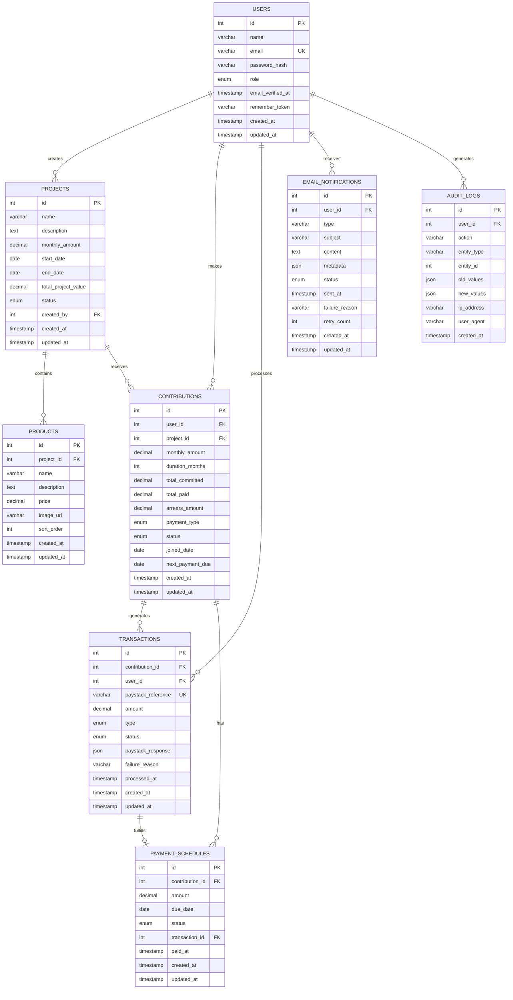

# Entity Relationship Diagram (ERD)
## Sannu-Sannu SaaS Platform

### Database Schema Overview

The Sannu-Sannu platform uses a relational database design optimized for contribution tracking, project management, and payment processing.

### Entity Relationship Diagram

### Entity Definitions

#### USERS Table
Stores user account information and authentication data.

| Column | Type | Constraints | Description |
|--------|------|-------------|-------------|
| id | INT | PRIMARY KEY, AUTO_INCREMENT | Unique user identifier |
| name | VARCHAR(255) | NOT NULL | User's full name |
| email | VARCHAR(255) | NOT NULL, UNIQUE | User's email address |
| password_hash | VARCHAR(255) | NOT NULL | Bcrypt hashed password |
| role | ENUM('admin', 'user') | DEFAULT 'user' | User role for access control |
| email_verified_at | TIMESTAMP | NULL | Email verification timestamp |
| remember_token | VARCHAR(100) | NULL | Remember me token |
| created_at | TIMESTAMP | DEFAULT CURRENT_TIMESTAMP | Record creation time |
| updated_at | TIMESTAMP | DEFAULT CURRENT_TIMESTAMP ON UPDATE | Last update time |

**Indexes:**
- PRIMARY KEY (id)
- UNIQUE KEY (email)
- INDEX (role)

#### PROJECTS Table
Stores project information and lifecycle management data.

| Column | Type | Constraints | Description |
|--------|------|-------------|-------------|
| id | INT | PRIMARY KEY, AUTO_INCREMENT | Unique project identifier |
| name | VARCHAR(255) | NOT NULL | Project name |
| description | TEXT | NULL | Project description |
| monthly_amount | DECIMAL(10,2) | NOT NULL | Monthly contribution amount |
| start_date | DATE | NOT NULL | Project start date |
| end_date | DATE | NOT NULL | Project end date |
| total_project_value | DECIMAL(12,2) | NOT NULL | Total project value |
| status | ENUM('draft', 'active', 'paused', 'completed', 'cancelled') | DEFAULT 'draft' | Project status |
| created_by | INT | FOREIGN KEY REFERENCES users(id) | Admin who created project |
| created_at | TIMESTAMP | DEFAULT CURRENT_TIMESTAMP | Record creation time |
| updated_at | TIMESTAMP | DEFAULT CURRENT_TIMESTAMP ON UPDATE | Last update time |

**Indexes:**
- PRIMARY KEY (id)
- FOREIGN KEY (created_by) REFERENCES users(id)
- INDEX (status)
- INDEX (start_date, end_date)

#### PRODUCTS Table
Stores individual products within projects.

| Column | Type | Constraints | Description |
|--------|------|-------------|-------------|
| id | INT | PRIMARY KEY, AUTO_INCREMENT | Unique product identifier |
| project_id | INT | FOREIGN KEY REFERENCES projects(id) | Associated project |
| name | VARCHAR(255) | NOT NULL | Product name |
| description | TEXT | NULL | Product description |
| price | DECIMAL(10,2) | NOT NULL | Individual product price |
| image_url | VARCHAR(500) | NULL | Product image URL |
| sort_order | INT | DEFAULT 0 | Display order |
| created_at | TIMESTAMP | DEFAULT CURRENT_TIMESTAMP | Record creation time |
| updated_at | TIMESTAMP | DEFAULT CURRENT_TIMESTAMP ON UPDATE | Last update time |

**Indexes:**
- PRIMARY KEY (id)
- FOREIGN KEY (project_id) REFERENCES projects(id) ON DELETE CASCADE
- INDEX (project_id, sort_order)

#### CONTRIBUTIONS Table
Tracks user participation in projects and payment commitments.

| Column | Type | Constraints | Description |
|--------|------|-------------|-------------|
| id | INT | PRIMARY KEY, AUTO_INCREMENT | Unique contribution identifier |
| user_id | INT | FOREIGN KEY REFERENCES users(id) | Contributing user |
| project_id | INT | FOREIGN KEY REFERENCES projects(id) | Target project |
| monthly_amount | DECIMAL(10,2) | NOT NULL | Monthly contribution amount |
| duration_months | INT | NOT NULL | Contribution duration in months |
| total_committed | DECIMAL(12,2) | NOT NULL | Total commitment amount |
| total_paid | DECIMAL(12,2) | DEFAULT 0.00 | Amount paid so far |
| arrears_amount | DECIMAL(10,2) | DEFAULT 0.00 | Outstanding arrears |
| payment_type | ENUM('monthly', 'one_time') | NOT NULL | Payment method |
| status | ENUM('active', 'completed', 'cancelled', 'suspended') | DEFAULT 'active' | Contribution status |
| joined_date | DATE | NOT NULL | Date user joined project |
| next_payment_due | DATE | NULL | Next payment due date |
| created_at | TIMESTAMP | DEFAULT CURRENT_TIMESTAMP | Record creation time |
| updated_at | TIMESTAMP | DEFAULT CURRENT_TIMESTAMP ON UPDATE | Last update time |

**Indexes:**
- PRIMARY KEY (id)
- FOREIGN KEY (user_id) REFERENCES users(id)
- FOREIGN KEY (project_id) REFERENCES projects(id)
- UNIQUE KEY (user_id, project_id)
- INDEX (status)
- INDEX (next_payment_due)

#### TRANSACTIONS Table
Records all payment transactions and Paystack interactions.

| Column | Type | Constraints | Description |
|--------|------|-------------|-------------|
| id | INT | PRIMARY KEY, AUTO_INCREMENT | Unique transaction identifier |
| contribution_id | INT | FOREIGN KEY REFERENCES contributions(id) | Associated contribution |
| user_id | INT | FOREIGN KEY REFERENCES users(id) | Transaction user |
| paystack_reference | VARCHAR(100) | UNIQUE | Paystack transaction reference |
| amount | DECIMAL(10,2) | NOT NULL | Transaction amount |
| type | ENUM('monthly', 'arrears', 'one_time') | NOT NULL | Transaction type |
| status | ENUM('pending', 'success', 'failed', 'cancelled') | DEFAULT 'pending' | Transaction status |
| paystack_response | JSON | NULL | Full Paystack response |
| failure_reason | VARCHAR(500) | NULL | Failure description |
| processed_at | TIMESTAMP | NULL | Processing completion time |
| created_at | TIMESTAMP | DEFAULT CURRENT_TIMESTAMP | Record creation time |
| updated_at | TIMESTAMP | DEFAULT CURRENT_TIMESTAMP ON UPDATE | Last update time |

**Indexes:**
- PRIMARY KEY (id)
- FOREIGN KEY (contribution_id) REFERENCES contributions(id)
- FOREIGN KEY (user_id) REFERENCES users(id)
- UNIQUE KEY (paystack_reference)
- INDEX (status)
- INDEX (created_at)

#### PAYMENT_SCHEDULES Table
Manages scheduled payments for monthly contributions.

| Column | Type | Constraints | Description |
|--------|------|-------------|-------------|
| id | INT | PRIMARY KEY, AUTO_INCREMENT | Unique schedule identifier |
| contribution_id | INT | FOREIGN KEY REFERENCES contributions(id) | Associated contribution |
| amount | DECIMAL(10,2) | NOT NULL | Scheduled payment amount |
| due_date | DATE | NOT NULL | Payment due date |
| status | ENUM('pending', 'paid', 'overdue', 'skipped') | DEFAULT 'pending' | Payment status |
| transaction_id | INT | FOREIGN KEY REFERENCES transactions(id) | Fulfilling transaction |
| paid_at | TIMESTAMP | NULL | Payment completion time |
| created_at | TIMESTAMP | DEFAULT CURRENT_TIMESTAMP | Record creation time |
| updated_at | TIMESTAMP | DEFAULT CURRENT_TIMESTAMP ON UPDATE | Last update time |

**Indexes:**
- PRIMARY KEY (id)
- FOREIGN KEY (contribution_id) REFERENCES contributions(id) ON DELETE CASCADE
- FOREIGN KEY (transaction_id) REFERENCES transactions(id)
- INDEX (due_date)
- INDEX (status)

#### EMAIL_NOTIFICATIONS Table
Tracks email notifications sent to users.

| Column | Type | Constraints | Description |
|--------|------|-------------|-------------|
| id | INT | PRIMARY KEY, AUTO_INCREMENT | Unique notification identifier |
| user_id | INT | FOREIGN KEY REFERENCES users(id) | Recipient user |
| type | VARCHAR(50) | NOT NULL | Notification type |
| subject | VARCHAR(255) | NOT NULL | Email subject |
| content | TEXT | NOT NULL | Email content |
| metadata | JSON | NULL | Additional notification data |
| status | ENUM('pending', 'sent', 'failed') | DEFAULT 'pending' | Delivery status |
| sent_at | TIMESTAMP | NULL | Delivery timestamp |
| failure_reason | VARCHAR(500) | NULL | Failure description |
| retry_count | INT | DEFAULT 0 | Retry attempts |
| created_at | TIMESTAMP | DEFAULT CURRENT_TIMESTAMP | Record creation time |
| updated_at | TIMESTAMP | DEFAULT CURRENT_TIMESTAMP ON UPDATE | Last update time |

**Indexes:**
- PRIMARY KEY (id)
- FOREIGN KEY (user_id) REFERENCES users(id)
- INDEX (type)
- INDEX (status)
- INDEX (created_at)

#### AUDIT_LOGS Table
Maintains audit trail for system actions and changes.

| Column | Type | Constraints | Description |
|--------|------|-------------|-------------|
| id | INT | PRIMARY KEY, AUTO_INCREMENT | Unique log identifier |
| user_id | INT | FOREIGN KEY REFERENCES users(id) | Acting user |
| action | VARCHAR(100) | NOT NULL | Action performed |
| entity_type | VARCHAR(50) | NOT NULL | Affected entity type |
| entity_id | INT | NOT NULL | Affected entity ID |
| old_values | JSON | NULL | Previous values |
| new_values | JSON | NULL | New values |
| ip_address | VARCHAR(45) | NULL | User IP address |
| user_agent | VARCHAR(500) | NULL | User agent string |
| created_at | TIMESTAMP | DEFAULT CURRENT_TIMESTAMP | Action timestamp |

**Indexes:**
- PRIMARY KEY (id)
- FOREIGN KEY (user_id) REFERENCES users(id)
- INDEX (entity_type, entity_id)
- INDEX (action)
- INDEX (created_at)

### Database Constraints and Rules

#### Business Rules Enforced by Database
1. **Unique Project Participation**: Users can only join each project once
2. **Payment Integrity**: Transactions must reference valid contributions
3. **Date Consistency**: Project end dates must be after start dates
4. **Amount Validation**: All monetary amounts must be positive
5. **Status Transitions**: Certain status changes require specific conditions

#### Referential Integrity
- All foreign key relationships enforce CASCADE DELETE where appropriate
- Orphaned records are prevented through proper constraint definitions
- Transaction isolation ensures data consistency during concurrent operations

#### Data Validation
- Email addresses validated at application and database level
- Monetary amounts stored with appropriate precision (2 decimal places)
- Enum values restrict status fields to valid options
- JSON fields validated for proper structure

### Performance Considerations

#### Indexing Strategy
- Primary keys for fast record lookup
- Foreign keys for efficient joins
- Composite indexes for common query patterns
- Covering indexes for frequently accessed columns

#### Query Optimization
- Denormalized fields (total_paid, arrears_amount) for performance
- Scheduled maintenance for index optimization
- Query execution plan monitoring
- Connection pooling for concurrent access

#### Scaling Considerations
- Partitioning strategy for large transaction tables
- Read replica setup for reporting queries
- Caching layer for frequently accessed data
- Archive strategy for historical data