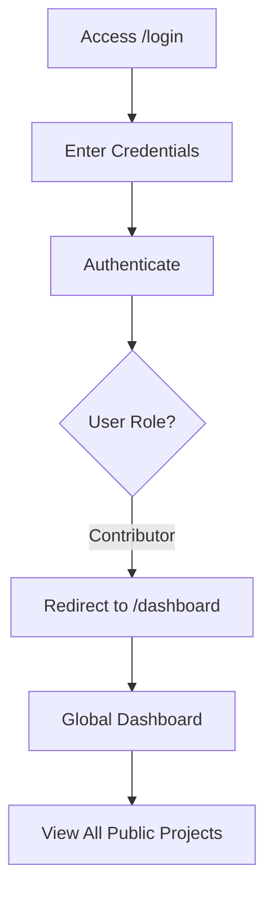
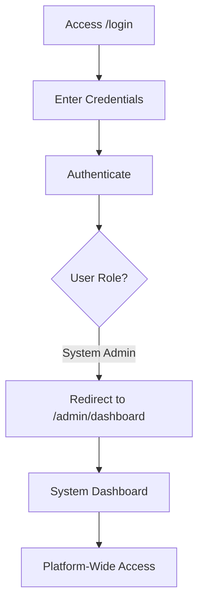

# Authentication Architecture

## Overview

The Sannu-Sannu platform uses a **Authentication System** that allows users to authenticate once and access multiple tenants based on their roles. This architecture supports cross-tenant project discovery for contributors while maintaining secure tenant-specific management for administrators.

## Architecture Principles

### 1. **Global User Identity**
- Users authenticate globally, not per tenant
- Single email address across the entire platform
- User roles can span multiple tenants

### 2. **Role-Based Access Patterns**
- **Contributors**: Global access to public projects from all tenants
- **Admins**: Tenant selection → Tenant-specific management
- **System Admins**: Platform-wide access to all data

### 3. **Flexible Tenant Context**
- Tenant context is operational, not authentication-based
- Admin users can switch between tenants without re-authentication
- Contributors don't need tenant context for most operations

## User Role System

### Global Roles (stored in `users.role`)

#### **System Admin**
- Full platform access
- Can view and manage all tenants
- Access to system-wide analytics and settings
- No tenant selection required

#### **Contributor** 
- Default role for all users
- Can discover and join public projects from any tenant
- Can receive private project invitations from any tenant
- Uses global dashboard showing cross-tenant projects

### Tenant-Specific Roles (stored in `user_tenant_roles`)

#### **Tenant Admin**
- Full administrative access within specific tenant
- Can manage projects, users, and settings for that tenant
- Can be tenant admin for multiple tenants

#### **Project Manager**
- Project management access within specific tenant
- Can create and manage projects for that tenant
- Limited administrative capabilities

## Authentication Flows

### Contributor Authentication


### Admin Authentication
```mermaid
flowchart TD
    A[Access /login] --> B[Enter Credentials]
    B --> C[Authenticate]
    C --> D{User Role?}
    D -->|Has Tenant Roles| E[Redirect to /select-tenant]
    E --> F[Show Available Tenants]
    F --> G[User Selects Tenant]
    G --> H[Store in Session]
    H --> I[Redirect to /{tenant}/dashboard]
```

### System Admin Authentication


## Route Architecture

### Global Routes (No Tenant Context)
```
/login                  - Authentication
/register              - Global user registration
/dashboard             - Global contributor dashboard
/select-tenant         - Tenant selection for admins
/admin/dashboard       - System admin dashboard
/admin/tenants         - System admin tenant management
/admin/users           - System admin user management
```

### Tenant-Specific Routes (Operational Context)
```
/{tenant}/dashboard    - Tenant admin dashboard
/{tenant}/projects     - Tenant project management
/{tenant}/settings     - Tenant configuration
/{tenant}/users        - Tenant user management
```

## Database Schema

### Core Tables

#### **users** (Global Users)
```sql
- id
- name
- email (globally unique)
- password
- role (system_admin, contributor)
- phone, avatar_url, bio
- is_active
- timestamps
```

#### **user_tenant_roles** (Multi-Tenant Roles)
```sql
- id
- user_id (FK to users)
- tenant_id (FK to tenants)
- role (tenant_admin, project_manager)
- is_active
- timestamps
- UNIQUE(user_id, tenant_id)
```

#### **tenants** (Organizations)
```sql
- id
- slug (unique)
- name
- domain, logo_url
- settings (JSON)
- is_active
- timestamps
```

## Access Control Patterns

### Project Visibility

#### **Public Projects**
- Visible to all authenticated users
- Contributors can join from any tenant
- Displayed in global dashboard

#### **Private Projects**
- Visible only to invited users
- Invitations can come from any tenant
- Access controlled by invitation system

### Administrative Access

#### **Tenant-Scoped Operations**
```php
// Check if user has role in specific tenant
$user->hasRoleInTenant(Role::TENANT_ADMIN, $tenantId);

// Get user's role in tenant
$role = $user->getRoleInTenant($tenantId);

// Verify tenant access before operations
Gate::authorize('manage-tenant', $tenant);
```

#### **System-Wide Operations**
```php
// System admin access
Gate::authorize('manage-platform');

// Cross-tenant queries
$allProjects = Project::with('tenant')->get();
```

## Session Management

### Tenant Selection Storage
```php
// Store selected tenant for admin users
session(['selected_tenant_id' => $tenantId]);

// Retrieve current tenant context
$tenantId = session('selected_tenant_id');
```

### Security Considerations
- Tenant selection validated against user permissions
- Session invalidation on logout clears tenant context
- CSRF protection maintained across tenant switches

## Implementation Benefits

### For Contributors
- **Simplified Access**: Single login for all projects
- **Cross-Tenant Discovery**: Find projects from any organization
- **Unified Experience**: One dashboard for all contributions

### For Administrators
- **Multi-Tenant Management**: Manage multiple organizations
- **Flexible Access**: Switch between tenants seamlessly
- **Role Flexibility**: Different roles in different tenants

### For System Administrators
- **Platform Oversight**: Complete visibility across all tenants
- **Centralized Management**: Manage users and tenants from one interface
- **System Analytics**: Cross-tenant reporting and analytics

### For Platform
- **Scalability**: Supports growth without authentication complexity
- **User Experience**: Reduces friction for cross-tenant participation
- **Administrative Efficiency**: Streamlined multi-tenant management

## Migration Considerations

### From Tenant-Scoped to Auth
1. **User Data Migration**: Remove tenant_id, create user_tenant_roles
2. **Route Updates**: Add global routes, maintain tenant routes
3. **Controller Updates**: Handle optional tenant context
4. **Frontend Updates**: Support both global and tenant-specific views

### Backward Compatibility
- Existing tenant-specific routes continue to work
- Tenant middleware handles both patterns
- Gradual migration of features to global patterns

## Security Measures

### Authentication Security
- Authentication with secure session management
- Role-based access control at multiple levels
- Tenant access validation for all operations

### Data Isolation
- Contributors see only public projects + their invitations
- Tenant admins see only their tenant's data
- System admins have controlled access to all data

### Authorization Patterns
- Platform-level policies for system operations
- Tenant-level policies for organizational operations
- Project-level policies for specific resource access

This Authentication architecture provides the flexibility needed for cross-tenant collaboration while maintaining security and proper access control at all levels.