# Use Case Diagram
## Sannu-Sannu SaaS Platform

### System Actors

#### Primary Actors
1. **User (Contributor)** - End users who participate in projects and make contributions across all tenants
2. **Tenant Admin** - Administrators who manage projects and users within specific tenant organizations
3. **System Admin** - Platform administrators who manage the entire system and all tenants
4. **Guest** - Unregistered visitors who can view public information

#### Secondary Actors
1. **Paystack System** - External payment processing service
2. **Email System** - External email delivery service
3. **System Scheduler** - Automated system processes

### Use Case Diagram

```mermaid
graph TB
    %% Actors
    User[👤 User<br/>Contributor]
    TenantAdmin[👨‍💼 Tenant<br/>Admin]
    SystemAdmin[👨‍💻 System<br/>Admin]
    Guest[👥 Guest]
    Paystack[💳 Paystack<br/>System]
    EmailSys[📧 Email<br/>System]
    Scheduler[⏰ System<br/>Scheduler]

    %% System Boundary
    subgraph "Sannu-Sannu Platform"
        %% Authentication Use Cases
        UC1[Register Account]
        UC2[Login to System]
        UC3[Select Tenant]
        UC4[Switch Tenant]
        UC5[Logout from System]
        UC6[Reset Password]
        UC7[Update Profile]

        %% Project Discovery Use Cases
        UC8[Browse All Public Projects]
        UC9[View Project Details]
        UC10[Search Cross-Tenant Projects]

        %% Project Participation Use Cases
        UC9[Join Project]
        UC10[Calculate Arrears]
        UC11[Select Payment Plan]
        UC12[View My Contributions]
        UC13[Track Progress]

        %% Payment Use Cases
        UC14[Initialize Payment]
        UC15[Process Payment]
        UC16[Verify Payment]
        UC17[Handle Payment Failure]
        UC18[View Payment History]

        %% Admin Project Management
        UC19[Create Project]
        UC20[Update Project]
        UC21[Activate Project]
        UC22[Deactivate Project]
        UC23[View All Projects]

        %% Admin User Management
        UC24[View All Users]
        UC25[Manage User Roles]
        UC26[View User Details]

        %% Admin Reporting
        UC27[View Contributors List]
        UC28[Export Contributor Data]
        UC29[Generate Reports]
        UC30[View System Analytics]

        %% Notification Use Cases
        UC31[Send Email Notifications]
        UC32[View Notifications]

        %% System Maintenance
        UC33[Process Scheduled Payments]
        UC34[Update Payment Status]
        UC35[Generate Payment Reminders]
        UC36[Cleanup Expired Sessions]
    end

    %% User Relationships
    User --> UC1
    User --> UC2
    User --> UC3
    User --> UC4
    User --> UC5
    User --> UC6
    User --> UC7
    User --> UC8
    User --> UC9
    User --> UC11
    User --> UC12
    User --> UC13
    User --> UC14
    User --> UC18
    User --> UC32

    %% Guest Relationships
    Guest --> UC1
    Guest --> UC2
    Guest --> UC6
    Guest --> UC7

    %% Admin Relationships
    Admin --> UC2
    Admin --> UC3
    Admin --> UC5
    Admin --> UC19
    Admin --> UC20
    Admin --> UC21
    Admin --> UC22
    Admin --> UC23
    Admin --> UC24
    Admin --> UC25
    Admin --> UC26
    Admin --> UC27
    Admin --> UC28
    Admin --> UC29
    Admin --> UC30

    %% External System Relationships
    UC15 --> Paystack
    UC16 --> Paystack
    UC31 --> EmailSys
    UC33 --> Scheduler
    UC34 --> Scheduler
    UC35 --> Scheduler
    UC36 --> Scheduler

    %% Include Relationships
    UC9 -.->|includes| UC10
    UC14 -.->|includes| UC15
    UC15 -.->|includes| UC16
    UC33 -.->|includes| UC14
    UC35 -.->|includes| UC31

    %% Extend Relationships
    UC17 -.->|extends| UC15
    UC10 -.->|extends| UC9
```

### Detailed Use Case Descriptions

#### Authentication & User Management

##### UC1: Register Account
**Actor**: Guest
**Description**: New users create accounts to access the platform
**Preconditions**: User has valid email address
**Main Flow**:
1. User provides name, email, and password
2. System validates input data
3. System creates user account with default role
4. System sends verification email
5. User verifies email address
**Postconditions**: User account is created and verified

##### UC2: Login to System
**Actor**: User, Tenant Admin, System Admin
**Description**: Registered users authenticate globally to access platform features
**Preconditions**: User has valid account credentials
**Main Flow**:
1. User accesses global login page (/login)
2. User provides email and password
3. System validates credentials globally
4. System determines user role and access patterns
5. System redirects based on role:
   - Contributors → Global dashboard
   - Admin users → Tenant selection
   - System admins → System dashboard
**Postconditions**: User is authenticated and redirected to appropriate interface

**Alternative Flow - Admin Tenant Selection**:
4a. User has tenant admin/manager roles
4b. System redirects to tenant selection page
4c. User selects which tenant to manage
4d. System stores tenant context in session
4e. System redirects to tenant-specific dashboard

##### UC3: Select Tenant
**Actor**: Tenant Admin
**Description**: Admin users select which tenant organization to manage
**Preconditions**: User is authenticated and has roles in multiple tenants
**Main Flow**:
1. System displays available tenants for user
2. User selects desired tenant to manage
3. System validates user access to selected tenant
4. System stores tenant context in session
5. System redirects to tenant-specific dashboard
**Postconditions**: User is operating within selected tenant context

##### UC5: Update Profile
**Actor**: User, Admin
**Description**: Users can modify their account information
**Preconditions**: User is logged in
**Main Flow**:
1. User accesses profile settings
2. User modifies allowed fields
3. System validates changes
4. System updates user record
5. System confirms changes
**Postconditions**: User profile is updated

#### Project Discovery & Participation

##### UC8: Browse All Public Projects
**Actor**: User, Guest
**Description**: Users can view public projects from all tenant organizations
**Preconditions**: None
**Main Flow**:
1. User accesses global projects dashboard
2. System displays active public projects from all tenants
3. User can filter and sort projects by tenant, category, etc.
4. System shows project summaries with tenant information
5. User can see cross-tenant project opportunities
**Postconditions**: User sees available projects across all organizations

##### UC9: Join Project
**Actor**: User
**Description**: Users can participate in projects by making commitments
**Preconditions**: User is logged in, project is active
**Main Flow**:
1. User selects project to join
2. System checks if user already participating
3. User selects contribution duration
4. System calculates total commitment
5. System calculates arrears if joining mid-project
6. User confirms participation
7. System creates contribution record
**Postconditions**: User is enrolled in project

##### UC13: Track Progress
**Actor**: User
**Description**: Users can monitor their contribution progress
**Preconditions**: User has active contributions
**Main Flow**:
1. User accesses dashboard
2. System calculates progress for each project
3. System displays progress bars and statistics
4. User can view detailed contribution history
**Postconditions**: User sees current progress status

#### Payment Processing

##### UC14: Initialize Payment
**Actor**: User
**Description**: Users initiate payments for their contributions
**Preconditions**: User has outstanding payment obligations
**Main Flow**:
1. User selects payment to make
2. System calculates payment amount
3. System creates Paystack payment session
4. System redirects user to Paystack
5. User completes payment on Paystack
**Postconditions**: Payment is initiated with Paystack

##### UC15: Process Payment
**Actor**: Paystack System
**Description**: External payment processing and callback handling
**Preconditions**: Payment has been initiated
**Main Flow**:
1. Paystack processes payment
2. Paystack sends webhook to system
3. System verifies webhook signature
4. System updates transaction status
5. System updates contribution balances
**Postconditions**: Payment is processed and recorded

#### Admin Project Management

##### UC19: Create Project
**Actor**: Admin
**Description**: Admins can create new projects for user participation
**Preconditions**: User has admin role
**Main Flow**:
1. Admin accesses project creation form
2. Admin provides project details
3. Admin adds products to project
4. System validates project data
5. System creates project in draft status
**Postconditions**: New project is created

##### UC21: Activate Project
**Actor**: Admin
**Description**: Admins can make projects available for user participation
**Preconditions**: Project exists in draft status
**Main Flow**:
1. Admin selects project to activate
2. System validates project completeness
3. Admin confirms activation
4. System changes project status to active
5. System makes project visible to users
**Postconditions**: Project is active and accepting participants

##### UC27: View Contributors List
**Actor**: Admin
**Description**: Admins can see all users participating in a project
**Preconditions**: Admin is logged in, project has contributors
**Main Flow**:
1. Admin selects project
2. System retrieves contributor data
3. System displays contributor list with details
4. Admin can sort and filter contributors
**Postconditions**: Admin sees project participation data

#### System Automation

##### UC33: Process Scheduled Payments
**Actor**: System Scheduler
**Description**: Automated processing of recurring monthly payments
**Preconditions**: Scheduled payments are due
**Main Flow**:
1. System identifies due payments
2. System creates payment transactions
3. System initiates Paystack payments
4. System processes payment responses
5. System updates payment schedules
**Postconditions**: Due payments are processed

##### UC35: Generate Payment Reminders
**Actor**: System Scheduler
**Description**: Automated email reminders for upcoming payments
**Preconditions**: Payments are approaching due date
**Main Flow**:
1. System identifies upcoming payments
2. System generates reminder emails
3. System sends emails to users
4. System logs notification delivery
**Postconditions**: Payment reminders are sent

### Use Case Relationships

#### Include Relationships
- **Join Project** includes **Calculate Arrears**: When users join mid-project, arrears calculation is mandatory
- **Initialize Payment** includes **Process Payment**: Payment initialization always involves processing
- **Process Scheduled Payments** includes **Initialize Payment**: Automated payments use the same initialization process

#### Extend Relationships
- **Handle Payment Failure** extends **Process Payment**: Additional handling when payments fail
- **Calculate Arrears** extends **Join Project**: Additional calculation for mid-project joining

### System Boundaries

#### Internal System Functions
- User authentication and authorization
- Project and contribution management
- Payment tracking and reporting
- Email notification queuing
- Data validation and business logic

#### External System Integrations
- Paystack payment processing
- SMTP email delivery
- System scheduling and automation
- File export and reporting

### Non-Functional Requirements

#### Performance
- System should handle 1000+ concurrent users
- Payment processing should complete within 30 seconds
- Page load times should be under 3 seconds

#### Security
- All payment data handled by Paystack (PCI compliance)
- User authentication with secure session management
- Admin functions protected by role-based access control

#### Reliability
- 99.9% system uptime
- Automated backup and recovery
- Graceful handling of external service failures

#### Usability
- Intuitive user interface design
- Mobile-responsive layout
- Clear error messages and user feedback